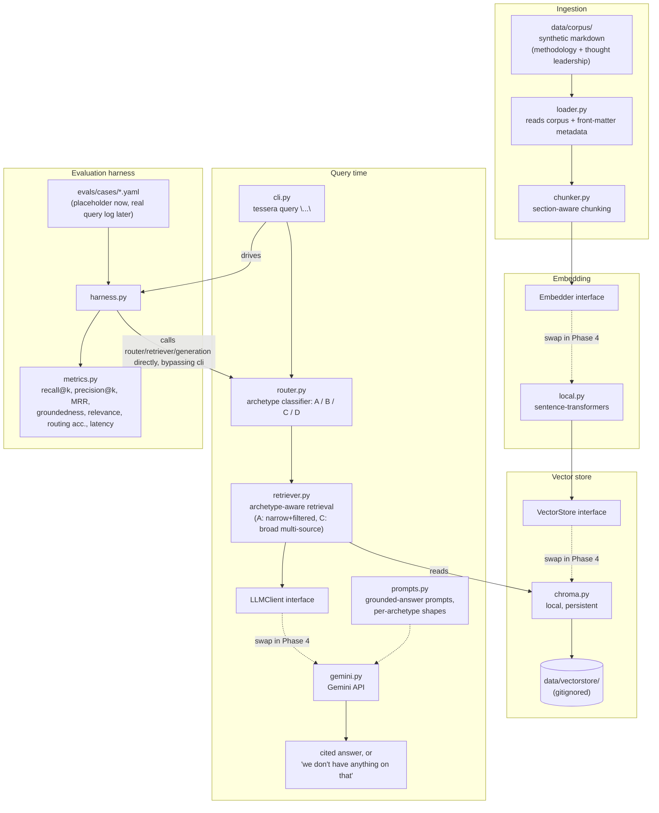

# Tessera

Internal knowledge assistant pilot for Meridian Advisory — helping consultants
find prior work, frameworks, and internal expertise instead of losing hours
searching for it.

**Status: Phase 1, in progress.** The local ingestion/retrieval core, the
grounded-generation path, and the CLI below are built and working. Real
consultant queries, archetype B, and everything past the local pilot are
still ahead — see the phase table below.

## Phase boundary — what's built vs. designed

| Phase | Status | Scope |
|---|---|---|
| **Phase 1** | 🚧 In progress (this repo) | Local ingestion + retrieval core over a synthetic corpus. Archetypes A (lookup) and C (synthesis) only. Grounded generation with citations. Eval harness runnable end-to-end via `tessera eval`, with 8 illustrative cases against the synthetic corpus — the real consultant query log lands in Phase 2. |
| Phase 2 | Designed, not built | Populate eval harness with the real consultant query log; tune against it. |
| Phase 3 | Designed, not built | Archetype B (expertise-finding), once HR data source/structure is known. |
| Phase 4 | Documented, not built | Move off local: Bedrock, OpenSearch Serverless, S3, Lambda. |
| Phase 5 | Documented, not built | MLOps: Terraform, CI/CD with eval gate, monitoring. |

**Deliberately not in Phase 1:** archetype D (comparative — refusal guardrail
only, confidentiality-sensitive), access-control enforcement (pilot corpus is
low-sensitivity by construction), PowerPoint ingestion, any AWS deployment, a
web UI. Full reasoning: [`CLAUDE.md`](CLAUDE.md) and
[`docs/Tessera_Phase1_Build_Plan.md`](docs/Tessera_Phase1_Build_Plan.md).

Background reading:
- [`docs/Tessera_Discovery_Findings.md`](docs/Tessera_Discovery_Findings.md) — the problem, the four query archetypes, the confidentiality model.
- [`docs/Tessera_Solution_Design.md`](docs/Tessera_Solution_Design.md) — full architecture including the Phase 4/5 AWS target.

## Architecture — Phase 1 (local)

This is what's actually being built now, not the eventual AWS target. Every
box on the left of a dashed interface boundary is swappable without touching
anything else — that's the single most important structural decision in
Phase 1 (see `CLAUDE.md` — "swappable ports"), because Phase 4 swaps these
implementations for managed AWS services without a rewrite.



**Archetype handling at query time:**
- **A (lookup)** — narrow k, metadata-filtered retrieval, precision-oriented.
- **B (expertise)** — not built; router returns "not yet supported."
- **C (synthesis)** — broad k, multi-source retrieval, synthesis prompt.
- **D (comparative)** — not attempted; router returns a confidentiality
  refusal.

**Phase 4 target** (documented, not built — see
[`docs/Tessera_Solution_Design.md` §4](docs/Tessera_Solution_Design.md)):
the `Embedder`, `VectorStore`, and `LLMClient` interfaces above get Bedrock
Titan/Cohere, OpenSearch Serverless, and Claude-via-Bedrock implementations
respectively, with S3 backing the corpus and Lambda fronting query handling.
Nothing in the Phase 1 pipeline shape needs to change for that swap — that's
the point of building it this way.

## Setup and usage

Requires Python 3.11+ and [`uv`](https://docs.astral.sh/uv/).

### Install

```sh
uv sync --extra dev
```

This installs the `tessera` package (editable) plus its dependencies,
including a CPU-only build of `torch` — Phase 1 is local-first and has no
GPU dependency (see `pyproject.toml`'s `tool.uv.sources` for why that pin
exists).

### Configure

```sh
cp .env.example .env
```

Fill in `GEMINI_API_KEY` in `.env` — get a free key at
[aistudio.google.com/apikey](https://aistudio.google.com/apikey). The
other two variables (`TESSERA_CORPUS_DIR`, `TESSERA_VECTORSTORE_DIR`) already
default to `data/corpus` and `data/vectorstore`, which match this repo's
layout, so they only need overriding if you relocate either directory.

Every command below needs `.env`'s variables exported into the shell first:

```sh
set -a; source .env; set +a
```

(`tessera` also reads a `.env` file directly via `pydantic-settings`, but
only when run from the repo root — exporting first is the reliable path
regardless of cwd.)

### Run

```sh
uv run tessera ingest
```

Loads `data/corpus`, section-chunks every document, embeds the chunks
locally (`sentence-transformers`, no API call), and persists a Chroma index
at `data/vectorstore`. Costs zero LLM calls. The first run downloads the
~90MB embedding model from Hugging Face (a one-time, few-minute pause with
no progress output) — this is the only network access in Phase 1 outside
the LLM call itself. Safe to re-run any time the
corpus changes.

```sh
uv run tessera query "What's our standard market entry framework?"
```

Routes the query to an archetype, retrieves from the index, and prints a
grounded answer with numbered citations back to source documents — or, for
a query with no on-corpus signal, a fixed "we don't have anything on that"
message with **no LLM call spent**. Archetype B (expertise-finding) and D
(comparative) queries are recognized and return a fixed non-answer instead
of attempting retrieval — see "Archetype handling at query time" above.

Each archetype-A/C query costs 2 Gemini calls (route + generate); B/D cost
1 (route only, no generation). The free tier caps `gemini-3.6-flash` at 20
requests/day — mind this if scripting multiple queries.

```sh
uv run tessera eval
```

Runs every case in `evals/cases/` through routing, retrieval, and
generation, judges each answer with an LLM grader, and prints a report:
routing accuracy, mean recall/precision/MRR@5, mean groundedness/relevance
(1-5), and per-archetype latency. `evals/cases/placeholder.yaml` ships with
8 illustrative cases against the synthetic corpus — swap in the real
consultant query log when it arrives (Phase 2) without touching the harness
itself. A full sweep costs roughly 2-3 Gemini calls per case; budget quota
accordingly. A case that errors (e.g. a rate limit) is reported as an
`ERROR` row and excluded from the aggregates rather than aborting the run.

### Tests

```sh
uv run pytest
```

Runs the deterministic suite (chunking, routing, metrics, config, CLI wiring
— no LLM calls). Live-LLM tests are opt-in via `RUN_LIVE_LLM_TESTS=1` and
skipped otherwise, so a routine test run never spends Gemini quota.

### Working across machines

This project runs on two machines (workstation + WSL2 laptop) synced through
GitHub. Both are configured with `pull.rebase = true` so `git pull` rebases
cleanly instead of creating a merge commit.

**First ritual on any machine — run `/git-cleaner` in Claude Code.** It checks
both repos (`cerberus-platform` and `tessera`) for uncommitted changes, fetches
and rebases from origin, and prunes stale remote-tracking branches.

**Golden rule:** push before switching machines. A clean push means the other
machine can always fast-forward without conflicts.

On a fresh clone, set the rebase pull strategy once per repo:

```sh
git config pull.rebase true
```
