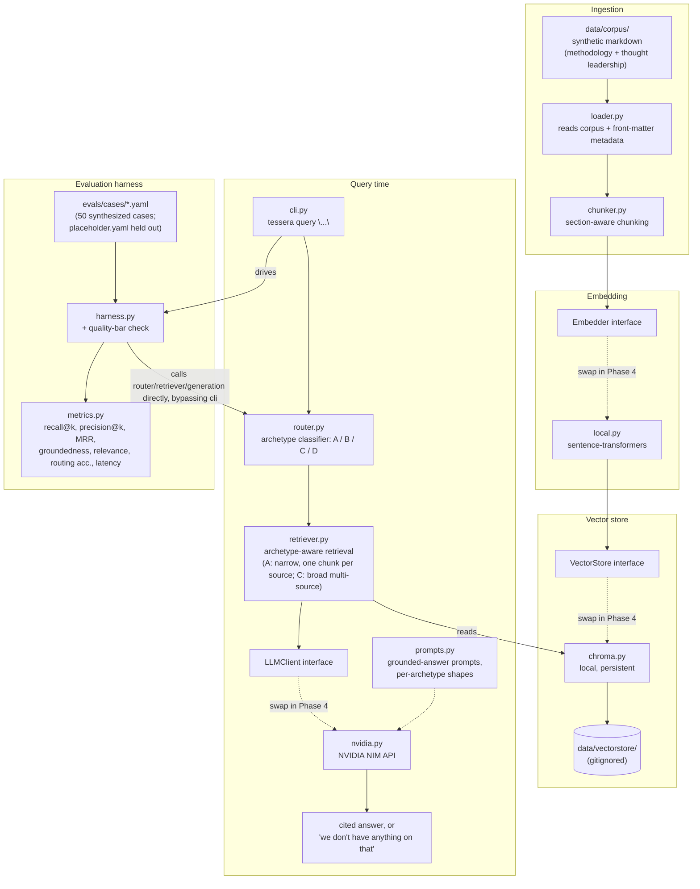

# Tessera

Internal knowledge assistant pilot for Meridian Advisory — helping consultants
find prior work, frameworks, and internal expertise instead of losing hours
searching for it.

**Status: Phase 2 complete** (`v0.2.0`). The local ingestion/retrieval core,
the grounded-generation path, the CLI below, and a populated + tuned
evaluation harness held to a documented quality bar are all built and
working. Archetype B (expertise-finding) and everything past the local
pilot are still ahead — see the phase table below.

## Phase boundary — what's built vs. designed

| Phase | Status | Scope |
|---|---|---|
| **Phase 1** | ✅ Complete (`v0.1.0`) | Local ingestion + retrieval core over a synthetic corpus. Archetypes A (lookup) and C (synthesis) only. Grounded generation with citations. Eval harness runnable end-to-end via `tessera eval`. |
| **Phase 2** | ✅ Complete (`v0.2.0`, this repo) | Eval set populated to 50 cases against the synthetic corpus and retrieval/generation tuned against it; a documented internal quality bar (`evals/QUALITY_BAR.md`) enforced via `tessera eval --check` on every retrieval/prompt PR. The consultant query log Discovery described is fictional and will never arrive — `evals/cases/query_log.yaml` is a deliberately, transparently synthesized stand-in. |
| Phase 3 | Designed, not built | Archetype B (expertise-finding), once HR data source/structure is known. |
| Phase 4 | Documented, not built | Move off local: Bedrock, OpenSearch Serverless, S3, Lambda. |
| Phase 5 | Documented, not built | MLOps: Terraform, CI/CD with eval gate, monitoring. |

**Deliberately not in Phase 1–2:** archetype D (comparative — refusal
guardrail only, confidentiality-sensitive), access-control enforcement (pilot
corpus is low-sensitivity by construction), PowerPoint ingestion, any AWS
deployment, a web UI. Full reasoning: [`CLAUDE.md`](CLAUDE.md),
[`docs/Tessera_Phase1_Build_Plan.md`](docs/Tessera_Phase1_Build_Plan.md), and
[`docs/Tessera_Phase2_Plan.md`](docs/Tessera_Phase2_Plan.md).

Background reading:
- [`docs/Tessera_Discovery_Findings.md`](docs/Tessera_Discovery_Findings.md) — the problem, the four query archetypes, the confidentiality model.
- [`docs/Tessera_Solution_Design.md`](docs/Tessera_Solution_Design.md) — full architecture including the Phase 4/5 AWS target.

## Architecture — Phase 1 (local)

This is what's actually being built now, not the eventual AWS target. Every
box on the left of a dashed interface boundary is swappable without touching
anything else — that's the single most important structural decision in
Phase 1 (see `CLAUDE.md` — "swappable ports"), because Phase 4 swaps these
implementations for managed AWS services without a rewrite.



**Archetype handling at query time:**
- **A (lookup)** — narrow k, one chunk per source document so a document
  family surfaces its members rather than one member's chunks filling
  every slot; precision-oriented.
- **B (expertise)** — not built; router returns "not yet supported."
- **C (synthesis)** — broad k, multi-source retrieval, synthesis prompt.
- **D (comparative)** — not attempted; router returns a confidentiality
  refusal.

**Phase 4 target** (documented, not built — see
[`docs/Tessera_Solution_Design.md` §4](docs/Tessera_Solution_Design.md)):
the `Embedder`, `VectorStore`, and `LLMClient` interfaces above get Bedrock
Titan/Cohere, OpenSearch Serverless, and Claude-via-Bedrock implementations
respectively, with S3 backing the corpus and Lambda fronting query handling.
Nothing in the Phase 1 pipeline shape needs to change for that swap — that's
the point of building it this way.

## Phase 2 — the quality bar

Phase 2 populated the eval set, tuned retrieval and generation against it,
and committed to a documented internal bar that every future
retrieval/prompt change is measured against. Full definition and rationale:
[`evals/QUALITY_BAR.md`](evals/QUALITY_BAR.md).

| Metric | Threshold | Gated? | Latest (50-case clean sweep, 2026-09-06) |
|---|---|---|---|
| Routing accuracy | ≥ 95% | yes | 100% |
| Mean recall@k (A/C) | ≥ 0.80 | yes | 0.95 |
| Mean MRR (A/C) | ≥ 0.90 | yes | 0.97 |
| Mean groundedness (1–5) | ≥ 4.5 | yes | 4.77 |
| Mean relevance (1–5) | ≥ 4.5 | yes | 4.60 |
| Per-case recall (A/C) | > 0.00 | yes | pass (min 0.50) |
| Mean precision@k (A/C) | reported | no | 0.42 |

`k` = 5. Precision is reported but not gated — it is confounded by
relevant-source labeling completeness (a genuinely relevant retrieved
chunk that just isn't listed in a case's `relevant_sources` counts
against it), and the corpus deliberately contains near-duplicate adjacent
documents as retrieval hard-negatives. See `QUALITY_BAR.md`.

## Setup and usage

Requires Python 3.11+ and [`uv`](https://docs.astral.sh/uv/).

### Install

```sh
uv sync --extra dev
```

This installs the `tessera` package (editable) plus its dependencies,
including a CPU-only build of `torch` — Phase 1 is local-first and has no
GPU dependency (see `pyproject.toml`'s `tool.uv.sources` for why that pin
exists).

### Configure

```sh
cp .env.example .env
```

Fill in `NVIDIA_API_KEY` in `.env` — get a free key at
[build.nvidia.com/nvidia/nemotron-3-ultra-550b-a55b](https://build.nvidia.com/nvidia/nemotron-3-ultra-550b-a55b)
("Generate API Key"). The
other two variables (`TESSERA_CORPUS_DIR`, `TESSERA_VECTORSTORE_DIR`) already
default to `data/corpus` and `data/vectorstore`, which match this repo's
layout, so they only need overriding if you relocate either directory.

Every command below needs `.env`'s variables exported into the shell first:

```sh
set -a; source .env; set +a
```

(`tessera` also reads a `.env` file directly via `pydantic-settings`, but
only when run from the repo root — exporting first is the reliable path
regardless of cwd.)

### Run

```sh
uv run tessera ingest
```

Loads `data/corpus`, section-chunks every document, embeds the chunks
locally (`sentence-transformers`, no API call), and persists a Chroma index
at `data/vectorstore`. Costs zero LLM calls. The first run downloads the
~90MB embedding model from Hugging Face (a one-time, few-minute pause with
no progress output) — this is the only network access in Phase 1 outside
the LLM call itself. Safe to re-run any time the
corpus changes.

```sh
uv run tessera query "What's our standard market entry framework?"
```

Routes the query to an archetype, retrieves from the index, and prints a
grounded answer with numbered citations back to source documents — or, for
a query with no on-corpus signal, a fixed "we don't have anything on that"
message with **no LLM call spent**. Archetype B (expertise-finding) and D
(comparative) queries are recognized and return a fixed non-answer instead
of attempting retrieval — see "Archetype handling at query time" above.

Each archetype-A/C query costs 2 NVIDIA NIM calls (route + generate); B/D
cost 1 (route only, no generation). The free tier allows up to 40
requests/minute and 10,000 requests/day — comfortably enough for scripted
or looped queries.

```sh
uv run tessera eval          # print the report
uv run tessera eval --check   # ...and exit non-zero on any gated-bar failure
```

Runs every case in `evals/cases/` through routing, retrieval, and
generation, judges each answer with an LLM grader, and prints a report:
routing accuracy, mean recall/precision/MRR@5, mean groundedness/relevance
(1-5), per-archetype latency, and the quality-bar PASS/FAIL block.
`evals/cases/` holds **50 cases** — `query_log.yaml` (42, the synthesized
stand-in for the fictional consultant query log; the tuning set) and
`placeholder.yaml` (8, held out as an overfitting check-set). A full sweep
costs roughly 2-3 NVIDIA NIM calls per case — well within the 10,000/day
free-tier limit. A case that errors (e.g. a transient 503) is reported as
an `ERROR` row and excluded from the aggregates rather than aborting the
run.

`--check` is the manual regression gate (the precursor to the Phase 5 CI
gate): any change touching `retriever.py`, `router.py`, `chunker.py`,
`generation/`, or the eval set must paste a fresh `--check` report into
its PR. The bar itself lives in
[`evals/QUALITY_BAR.md`](evals/QUALITY_BAR.md).

### Tests

```sh
uv run pytest
```

Runs the deterministic suite (chunking, routing, metrics, config, CLI wiring
— no LLM calls). Live-LLM tests are opt-in via `RUN_LIVE_LLM_TESTS=1` and
skipped otherwise, so a routine test run never spends live LLM quota.

### Working across machines

This project runs on two machines (workstation + WSL2 laptop) synced through
GitHub. Both are configured with `pull.rebase = true` so `git pull` rebases
cleanly instead of creating a merge commit.

**First ritual on any machine — run `/git-cleaner` in Claude Code.** It checks
both repos (`cerberus-platform` and `tessera`) for uncommitted changes, fetches
and rebases from origin, and prunes stale remote-tracking branches.

**Golden rule:** push before switching machines. A clean push means the other
machine can always fast-forward without conflicts.

On a fresh clone, set the rebase pull strategy once per repo:

```sh
git config pull.rebase true
```
