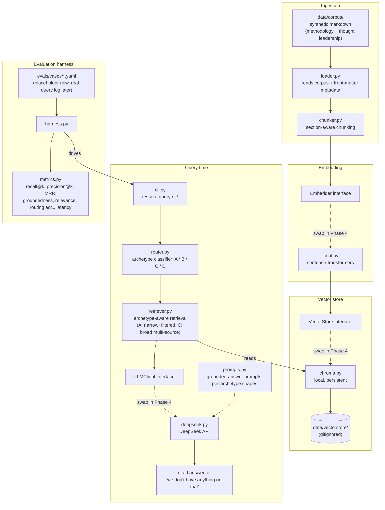

# Tessera

Internal knowledge assistant pilot for Meridian Advisory — helping consultants
find prior work, frameworks, and internal expertise instead of losing hours
searching for it.

**Status: Phase 1, in progress.** This README will grow a full setup/usage
section once the CLI exists (Task 8). For now it states the phase boundary
and the Phase 1 architecture.

## Phase boundary — what's built vs. designed

| Phase | Status | Scope |
|---|---|---|
| **Phase 1** | 🚧 In progress (this repo) | Local ingestion + retrieval core over a synthetic corpus. Archetypes A (lookup) and C (synthesis) only. Grounded generation with citations. Eval harness scaffold, metrics implemented, cases empty. |
| Phase 2 | Designed, not built | Populate eval harness with the real consultant query log; tune against it. |
| Phase 3 | Designed, not built | Archetype B (expertise-finding), once HR data source/structure is known. |
| Phase 4 | Documented, not built | Move off local: Bedrock, OpenSearch Serverless, S3, Lambda. |
| Phase 5 | Documented, not built | MLOps: Terraform, CI/CD with eval gate, monitoring. |

**Deliberately not in Phase 1:** archetype D (comparative — refusal guardrail
only, confidentiality-sensitive), access-control enforcement (pilot corpus is
low-sensitivity by construction), PowerPoint ingestion, any AWS deployment, a
web UI. Full reasoning: [`CLAUDE.md`](CLAUDE.md) and
[`docs/Tessera_Phase1_Build_Plan.md`](docs/Tessera_Phase1_Build_Plan.md).

Background reading:
- [`docs/Tessera_Discovery_Findings.md`](docs/Tessera_Discovery_Findings.md) — the problem, the four query archetypes, the confidentiality model.
- [`docs/Tessera_Solution_Design.md`](docs/Tessera_Solution_Design.md) — full architecture including the Phase 4/5 AWS target.

## Architecture — Phase 1 (local)

This is what's actually being built now, not the eventual AWS target. Every
box on the left of a dashed interface boundary is swappable without touching
anything else — that's the single most important structural decision in
Phase 1 (see `CLAUDE.md` — "swappable ports"), because Phase 4 swaps these
implementations for managed AWS services without a rewrite.

**Archetype handling at query time:**
- **A (lookup)** — narrow k, metadata-filtered retrieval, precision-oriented.
- **B (expertise)** — not built; router returns "not yet supported."
- **C (synthesis)** — broad k, multi-source retrieval, synthesis prompt.
- **D (comparative)** — not attempted; router returns a confidentiality
  refusal.

**Phase 4 target** (documented, not built — see
[`docs/Tessera_Solution_Design.md` §4](docs/Tessera_Solution_Design.md)):
the `Embedder`, `VectorStore`, and `LLMClient` interfaces above get Bedrock
Titan/Cohere, OpenSearch Serverless, and Claude-via-Bedrock implementations
respectively, with S3 backing the corpus and Lambda fronting query handling.
Nothing in the Phase 1 pipeline shape needs to change for that swap — that's
the point of building it this way.

## Setup and usage

Not yet — arrives in Task 8 once `pyproject.toml`, the package, and the CLI
exist. See [`checkpoint.md`](checkpoint.md) for current build status.
