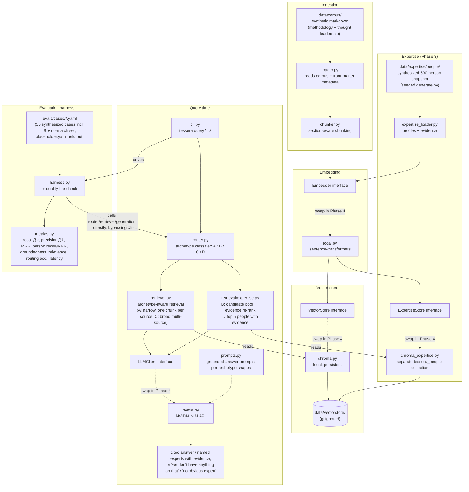

# Tessera

Internal knowledge assistant pilot for Meridian Advisory — helping consultants
find prior work, frameworks, and internal expertise instead of losing hours
searching for it.

**Status: Phase 3 complete** (`v0.3.0`). The local ingestion/retrieval core,
the grounded-generation path, archetype B (expertise-finding) over a
synthesized firm expertise dataset, the CLI below, and a populated + tuned
evaluation harness held to a documented quality bar (A/C and B) are all
built and working. Everything past the local pilot — AWS, CI/CD, real HR
integration — is still ahead; see the phase table below.

## Phase boundary — what's built vs. designed

| Phase | Status | Scope |
|---|---|---|
| **Phase 1** | ✅ Complete (`v0.1.0`) | Local ingestion + retrieval core over a synthetic corpus. Archetypes A (lookup) and C (synthesis) only. Grounded generation with citations. Eval harness runnable end-to-end via `tessera eval`. |
| **Phase 2** | ✅ Complete (`v0.2.0`) | Eval set populated to 50 cases against the synthetic corpus and retrieval/generation tuned against it; a documented internal quality bar (`evals/QUALITY_BAR.md`) enforced via `tessera eval --check` on every retrieval/prompt PR. The consultant query log Discovery described is fictional and will never arrive — `evals/cases/query_log.yaml` is a deliberately, transparently synthesized stand-in. |
| **Phase 3** | ✅ Complete (`v0.3.0`, this repo) | Archetype B (expertise-finding) built end to end: a seeded, synthesized 600-consultant expertise dataset (`data/expertise/` — the HR data is fictional, like the corpus) indexed behind an `ExpertiseStore` port, evidence-ranked people retrieval, grounded "who should I talk to" answers, and B metrics (person recall/MRR, a no-match refusal set) gated in the quality bar. |
| Phase 4 | Documented, not built | Move off local: Bedrock, OpenSearch Serverless, S3, Lambda. |
| Phase 5 | Documented, not built | MLOps: Terraform, CI/CD with eval gate, monitoring. |

**Deliberately not in Phases 1–3:** archetype D (comparative — refusal
guardrail only, confidentiality-sensitive), real HR-system integration
(Workday / SSO directory — the expertise dataset is a dated static
snapshot whose age the answer surfaces, with no live sync),
access-control enforcement (pilot corpus and expertise dataset are
low-sensitivity by construction), PowerPoint ingestion, any AWS
deployment, a web UI. Full reasoning: [`CLAUDE.md`](CLAUDE.md),
[`docs/Tessera_Phase1_Build_Plan.md`](docs/Tessera_Phase1_Build_Plan.md),
[`docs/Tessera_Phase2_Plan.md`](docs/Tessera_Phase2_Plan.md), and
[`docs/Tessera_Phase3_Plan.md`](docs/Tessera_Phase3_Plan.md).

Background reading:
- [`docs/Tessera_Discovery_Findings.md`](docs/Tessera_Discovery_Findings.md) — the problem, the four query archetypes, the confidentiality model.
- [`docs/Tessera_Solution_Design.md`](docs/Tessera_Solution_Design.md) — full architecture including the Phase 4/5 AWS target.

## Architecture — local (Phases 1–3)

This is what's actually built, not the eventual AWS target. Every
box on the left of a dashed interface boundary is swappable without touching
anything else — that's the single most important structural decision in
Phase 1 (see `CLAUDE.md` — "swappable ports"), because Phase 4 swaps these
implementations for managed AWS services without a rewrite. Phase 3 added a
second, parallel path for archetype B: people, not documents, behind their
own `ExpertiseStore` port (reusing the same `Embedder`).


```mermaid
flowchart TB
    subgraph ingest["Ingestion"]
        corpus["data/corpus/<br/>synthetic markdown<br/>(methodology + thought leadership)"]
        loader["loader.py<br/>reads corpus + front-matter metadata"]
        chunker["chunker.py<br/>section-aware chunking"]
        corpus --> loader --> chunker
    end

    subgraph embed["Embedding"]
        embedIface["Embedder interface"]
        embedImpl["local.py<br/>sentence-transformers"]
        embedIface -.swap in Phase 4.-> embedImpl
    end

    subgraph store["Vector store"]
        storeIface["VectorStore interface"]
        storeImpl["chroma.py<br/>local, persistent"]
        storeIface -.swap in Phase 4.-> storeImpl
        persisted[("data/vectorstore/<br/>(gitignored)")]
        storeImpl --> persisted
    end

    subgraph people["Expertise (Phase 3)"]
        peopleData["data/expertise/people/<br/>synthesized 600-person snapshot<br/>(seeded generate.py)"]
        peopleLoader["expertise_loader.py<br/>profiles + evidence"]
        peopleIface["ExpertiseStore interface"]
        peopleImpl["chroma_expertise.py<br/>separate tessera_people collection"]
        peopleData --> peopleLoader
        peopleIface -.swap in Phase 4.-> peopleImpl
        peopleImpl --> persisted
    end

    chunker --> embedIface
    embedImpl --> storeIface
    peopleLoader --> embedIface
    embedImpl --> peopleIface

    subgraph query["Query time"]
        cli["cli.py<br/>tessera query \"...\""]
        router["router.py<br/>archetype classifier: A / B / C / D"]
        retriever["retriever.py<br/>archetype-aware retrieval<br/>(A: narrow, one chunk per source; C: broad multi-source)"]
        experts["retrieval/expertise.py<br/>B: candidate pool → evidence re-rank<br/>→ top 5 people with evidence"]
        genIface["LLMClient interface"]
        genImpl["nvidia.py<br/>NVIDIA NIM API"]
        prompts["prompts.py<br/>grounded-answer prompts,<br/>per-archetype shapes"]
        cli --> router --> retriever
        router --> experts
        retriever -->|reads| storeImpl
        experts -->|reads| peopleImpl
        retriever --> genIface
        experts --> genIface
        genIface -.swap in Phase 4.-> genImpl
        prompts -.-> genImpl
        genImpl --> answer["cited answer / named experts with evidence,<br/>or 'we don't have anything on that' / 'no obvious expert'"]
    end

    subgraph evalh["Evaluation harness"]
        cases["evals/cases/*.yaml<br/>(55 synthesized cases incl. B + no-match set;<br/>placeholder.yaml held out)"]
        harness["harness.py<br/>+ quality-bar check"]
        metrics["metrics.py<br/>recall@k, precision@k, MRR, person recall/MRR,<br/>groundedness, relevance, routing acc., latency"]
        cases --> harness
        harness -->|calls router/retriever/generation directly, bypassing cli| router
        harness --> metrics
    end

    cli -->|drives| harness
```

**Archetype handling at query time:**
- **A (lookup)** — narrow k, one chunk per source document so a document
  family surfaces its members rather than one member's chunks filling
  every slot; precision-oriented.
- **B (expertise)** — structured-evidence ranking, not document
  retrieval: a candidate pool from the people index is re-ranked by
  evidence (projects, authored documents, evidenced vs. self-reported
  skills), with "led/ran" and "recently" read from the query to order the
  shortlist. Answers name up to 5 people with their evidence, flag
  self-reported-only matches, surface the snapshot's age, and say "no
  obvious expert" (zero generation calls) when nobody clears the evidence
  floor. Requires `tessera index-people`.
- **C (synthesis)** — broad k, multi-source retrieval, synthesis prompt.
- **D (comparative)** — not attempted; router returns a confidentiality
  refusal.

**Phase 4 target** (documented, not built — see
[`docs/Tessera_Solution_Design.md` §4](docs/Tessera_Solution_Design.md)):
the `Embedder`, `VectorStore`, and `LLMClient` interfaces above get Bedrock
Titan/Cohere, OpenSearch Serverless, and Claude-via-Bedrock implementations
respectively, with S3 backing the corpus and Lambda fronting query handling.
Nothing in the Phase 1 pipeline shape needs to change for that swap — that's
the point of building it this way.

## The quality bar

Phase 2 populated the eval set, tuned retrieval and generation against it,
and committed to a documented internal bar that every future
retrieval/prompt change is measured against; Phase 3 extended it with
archetype-B rows. Full definition and rationale:
[`evals/QUALITY_BAR.md`](evals/QUALITY_BAR.md).

Latest: the Phase 3 exit sweep — full clean `tessera eval --check`,
2026-10-01, **55/55 cases, zero errors, `=> PASS`**.

| Metric | Threshold | Gated? | Latest |
|---|---|---|---|
| Routing accuracy | ≥ 95% | yes | 100% |
| Mean recall@k (A/C) | ≥ 0.80 | yes | 0.95 |
| Mean MRR (A/C) | ≥ 0.90 | yes | 0.97 |
| Mean groundedness (1–5, A/C) | ≥ 4.5 | yes | 4.83 |
| Mean relevance (1–5, A/C) | ≥ 4.5 | yes | 4.60 |
| Per-case recall (A/C) | > 0.00 | yes | pass (min 0.50) |
| Mean precision@k (A/C) | reported | no | 0.42 |
| Person recall@k (B) | ≥ 0.90 | yes | 0.91 |
| Person MRR (B) | ≥ 0.90 | yes | 1.00 |
| B groundedness (1–5) | ≥ 4.5 | yes | 5.00 |
| B relevance (1–5) | ≥ 4.5 | yes | 4.89 |
| Per-case person recall (B) | > 0.00 | yes | pass (min 0.60) |
| No-match correct-refusal rate (B) | 100% | yes | 100% |
| Person precision@k (B) | reported | no | 0.91 |

`k` = 5. Precision is reported but not gated — it is confounded by
relevant-source labeling completeness (a genuinely relevant retrieved
chunk that just isn't listed in a case's `relevant_sources` counts
against it), and the corpus deliberately contains near-duplicate adjacent
documents as retrieval hard-negatives. See `QUALITY_BAR.md`. The two
thinnest margins — A/C relevance (+0.10) and B person recall (+0.01, on
9 labelled cases) — are tracked there.

## Setup and usage

Requires Python 3.11+ and [`uv`](https://docs.astral.sh/uv/).

### Install

```sh
uv sync --extra dev
```

This installs the `tessera` package (editable) plus its dependencies,
including a CPU-only build of `torch` — Phase 1 is local-first and has no
GPU dependency (see `pyproject.toml`'s `tool.uv.sources` for why that pin
exists).

### Configure

```sh
cp .env.example .env
```

Fill in `NVIDIA_API_KEY` in `.env` — get a free key at
[build.nvidia.com/nvidia/nemotron-3-ultra-550b-a55b](https://build.nvidia.com/nvidia/nemotron-3-ultra-550b-a55b)
("Generate API Key"). The
other variables (`TESSERA_CORPUS_DIR`, `TESSERA_VECTORSTORE_DIR`,
`TESSERA_EXPERTISE_DIR`) already default to `data/corpus`,
`data/vectorstore`, and `data/expertise/people`, which match this repo's
layout, so they only need overriding if you relocate a directory.

Every command below needs `.env`'s variables exported into the shell first:

```sh
set -a; source .env; set +a
```

(`tessera` also reads a `.env` file directly via `pydantic-settings`, but
only when run from the repo root — exporting first is the reliable path
regardless of cwd.)

### Run

```sh
uv run tessera ingest
```

Loads `data/corpus`, section-chunks every document, embeds the chunks
locally (`sentence-transformers`, no API call), and persists a Chroma index
at `data/vectorstore`. Costs zero LLM calls. The first run downloads the
~90MB embedding model from Hugging Face (a one-time, few-minute pause with
no progress output) — this is the only network access in Phase 1 outside
the LLM call itself. Safe to re-run any time the
corpus changes.

```sh
uv run tessera index-people
```

Loads the synthesized expertise dataset (`data/expertise/people/`, 600
consultants), embeds one profile summary per person with the same local
model, and persists it as a separate `tessera_people` collection alongside
the document index. Also zero LLM calls. Needed for archetype B; re-run if
the dataset is regenerated.

```sh
uv run tessera query "What's our standard market entry framework?"
```

Routes the query to an archetype, retrieves from the index, and prints a
grounded answer with numbered citations back to source documents — or, for
a query with no on-corpus signal, a fixed "we don't have anything on that"
message with **no LLM call spent**. An archetype-B query ("Who has done
pricing work in retail?") prints a People section — named experts with
their evidence — or "no obvious expert"; if `index-people` hasn't been
run it says so rather than erroring. Archetype-D (comparative) queries
return a fixed confidentiality refusal — see "Archetype handling at query
time" above.

```sh
uv run tessera chat                              # ask questions one after another
uv run tessera chat --transcript session.md      # ...and save the session as Markdown
```

An interactive session over the same pipeline: it loads the indexes and
embedding model once, then answers each question exactly as `tessera
query` does, labelled with its archetype and latency. Each question is
answered independently — earlier questions aren't used as context
(conversation memory is part of the Phase 4+ session design, ADR 0003).
A question that fails (e.g. an LLM error after retries) is reported and
the session carries on; `exit` or Ctrl-D leaves.

Each archetype-A/B/C query costs 2 NVIDIA NIM calls (route + generate),
or 1 when nothing clears the relevance/evidence floor; D costs 1 (route
only). The free tier allows up to 40
requests/minute and 10,000 requests/day — comfortably enough for scripted
or looped queries.

```sh
uv run tessera eval          # print the report
uv run tessera eval --check   # ...and exit non-zero on any gated-bar failure
```

Runs every case in `evals/cases/` through routing, retrieval, and
generation, judges each answer with an LLM grader, and prints a report:
routing accuracy, mean recall/precision/MRR@5, mean groundedness/relevance
(1-5), the archetype-B person metrics (person recall/precision/MRR, B
judge scores, no-match refusal rate), per-archetype latency, and the
quality-bar PASS/FAIL block. Requires both `ingest` and `index-people`.
`evals/cases/` holds **55 cases** — `query_log.yaml` (41, the synthesized
stand-in for the fictional consultant query log; the tuning set),
`placeholder.yaml` (8, held out as an overfitting check-set), and
`expertise_nomatch.yaml` (6 B queries with no qualifying expert, which
must get the fixed refusal). A full sweep costs roughly 2-3 NVIDIA NIM
calls per case — well within the 10,000/day free-tier limit.

In practice NVIDIA's free tier throttles well below its documented 40
rpm, so `tessera eval` paces calls 3 s apart and retries 429/5xx with
exponential backoff (`generation/resilient.py`), printing `[n/total]`
progress to stderr; a full sweep takes roughly 1–1.5 hours. A case that
still fails after its retries is reported as an `ERROR` row and excluded
from the aggregates rather than aborting the run.

`--check` is the manual regression gate (the precursor to the Phase 5 CI
gate): any change touching `retrieval/` (`retriever.py`, `router.py`,
`expertise.py`), `chunker.py`, `generation/`, the expertise dataset or
its generator, or the eval set must paste a fresh `--check` report into
its PR. The bar itself lives in
[`evals/QUALITY_BAR.md`](evals/QUALITY_BAR.md).

### Tests

```sh
uv run pytest
```

Runs the deterministic suite (chunking, routing, metrics, expertise
loading/ranking, dataset-generator drift, config, CLI wiring — no LLM
calls). Live-LLM tests are opt-in via `RUN_LIVE_LLM_TESTS=1` and
skipped otherwise, so a routine test run never spends live LLM quota.

### Working across machines

This project runs on two machines (workstation + WSL2 laptop) synced through
GitHub. Both are configured with `pull.rebase = true` so `git pull` rebases
cleanly instead of creating a merge commit.

**First ritual on any machine — run `/git-cleaner` in Claude Code.** It checks
both repos (`cerberus` and `tessera`) for uncommitted changes, fetches
and rebases from origin, and prunes stale remote-tracking branches.

**Golden rule:** push before switching machines. A clean push means the other
machine can always fast-forward without conflicts.

On a fresh clone, set the rebase pull strategy once per repo:

```sh
git config pull.rebase true
```
