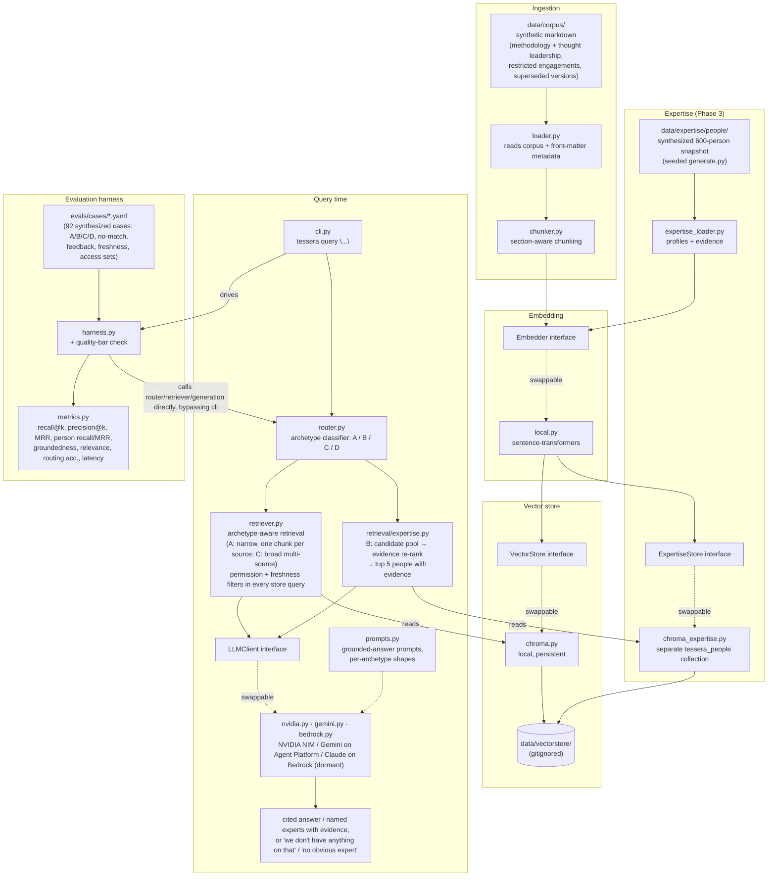

# Tessera

Internal knowledge assistant pilot for Meridian Advisory — helping consultants
find prior work, frameworks, and internal expertise instead of losing hours
searching for it.

**Status: Phase 4 complete** (`v0.4.0`). On top of the grounded,
archetype-routed RAG core (Phases 1–3), Phase 4 built four
production-readiness features, each measured in the eval harness: a
cloud LLM with cost accounting (Gemini on Google Cloud's Agent Platform),
request traces and a feedback-to-eval
loop, document freshness with a data-quality report, and
permission-aware retrieval over a restricted tier, proven by a gated
leakage eval. Everything still runs locally apart from the LLM call.
**Phase 5 is in progress:** LangChain, LangGraph and LangSmith built as a
parallel, measured stack beside the native core (ADR 0006). The ephemeral
Google Cloud deployment (Phase 6) and CI/CD (Phase 7) are ahead — see the
phase table and "Honest limits" below.

## Phase boundary — what's built vs. designed

| Phase | Status | Scope |
|---|---|---|
| **Phase 1** | ✅ Complete (`v0.1.0`) | Local ingestion + retrieval core over a synthetic corpus. Archetypes A (lookup) and C (synthesis) only. Grounded generation with citations. Eval harness runnable end-to-end via `tessera eval`. |
| **Phase 2** | ✅ Complete (`v0.2.0`) | Eval set populated to 50 cases against the synthetic corpus and retrieval/generation tuned against it; a documented internal quality bar (`evals/QUALITY_BAR.md`) enforced via `tessera eval --check` on every retrieval/prompt PR. The consultant query log Discovery described is fictional and will never arrive — `evals/cases/query_log.yaml` is a deliberately, transparently synthesized stand-in. |
| **Phase 3** | ✅ Complete (`v0.3.0`) | Archetype B (expertise-finding) built end to end: a seeded, synthesized 600-consultant expertise dataset (`data/expertise/` — the HR data is fictional, like the corpus) indexed behind an `ExpertiseStore` port, evidence-ranked people retrieval, grounded "who should I talk to" answers, and B metrics (person recall/MRR, a no-match refusal set) gated in the quality bar. |
| **Phase 4** | ✅ Complete (`v0.4.0`, this repo) | Production readiness, built and evaluated locally: Gemini on Agent Platform (ADR 0007; Claude on Bedrock built but dormant) + model routing + per-answer cost, an HTTP API, request traces + a feedback-to-eval loop, superseded-document handling + `tessera data-report`, and permission-aware retrieval over a synthetic restricted tier with gated leakage / authorized-recall / prompt-injection evals. See "Phase 4 — production readiness" below. |
| **Phase 5** | 🚧 In progress (`docs/Tessera_Phase5_Plan.md`) | LangChain / LangGraph / LangSmith as a **parallel, measured stack** beside the native core, which stays the default (ADR 0006): each layer swapped in and scored against native, LangGraph orchestration with a bounded corrective loop, a LangGraph human-review workflow (`interrupt` + checkpointer), and LangSmith tracing under taint-based redaction. Installed as an optional extra: `uv sync --extra lc`. |
| Phase 6 | Documented, not built | An **ephemeral** Google Cloud deployment for a demo (ADR 0007): container image, Terraform, one Cloud Run service with a chat UI — deployed, recorded, destroyed, teardown verified. |
| Phase 7 | Documented, not built | CI/CD with the eval gate, monitoring, real identity. |

**Deliberately not built (yet):** archetype D (comparative — refusal
guardrail only, confidentiality-sensitive), real HR-system integration
(the expertise dataset is a dated static snapshot whose age the answer
surfaces), real authentication (`--as` is a demo identity), automated
detection of anonymized-but-identifiable content (a human review gate
instead — Discovery §4), conversation memory, PowerPoint ingestion, a
chat UI (decided 2026-10-05: built in Phase 6, on Cloud Run), agents
and tool calling, and any cloud deployment. Full reasoning: [`CLAUDE.md`](CLAUDE.md) and the phase
plans in [`docs/`](docs/).

Background reading:
- [`docs/Tessera_Discovery_Findings.md`](docs/Tessera_Discovery_Findings.md) — the problem, the four query archetypes, the confidentiality model.
- [`docs/Tessera_Solution_Design.md`](docs/Tessera_Solution_Design.md) — full architecture including the Phase 4/5 AWS target.

## Phase 4 — production readiness

Phases 1–3 showed Tessera answers well: grounded, cited, routed by
archetype, held to an evaluated bar. Phase 4 goes after what actually
stops enterprise GenAI from reaching production. Gartner found over half
of GenAI projects abandoned after proof of concept, citing **poor data
quality, inadequate risk controls, escalating costs and unclear business
value**; MIT's 2025 *GenAI Divide* study attributes most failed pilots to
a **learning gap** — tools that don't capture feedback or improve. And
Tessera's own Discovery named client confidentiality as the defining
risk. Each feature answers one of those causes and carries its own
evidence in the eval harness
([`docs/Tessera_Phase4_Plan.md`](docs/Tessera_Phase4_Plan.md)):

| Failure cause | Feature | Evidence |
|---|---|---|
| Escalating costs | Gemini on Agent Platform (3.8 Flash routes, 3.1 Pro answers) behind the `LLMClient` port; tokens and cost per answer in every trace, report and API response | Live sweep 2026-10-05: **$0.012 per answer** (A $0.012 · B $0.009 · C $0.018 · D $0.001), $1.10 for 92 cases, every gated row passing |
| Learning gap, unclear value | A trace per request; thumbs up/down via the API or CLI; `tessera feedback to-cases` turns thumbs-down into *candidate* eval cases a human labels | One loop closed end to end: a thumbs-down became `fb001`, which drove a retrieval fix (parent-document expansion) and now scores relevance 5 |
| Poor data quality | Superseded document versions excluded in the store query, with a fixed note pointing to the current version; `tessera data-report` | Gated: superseded document cited as current = **0** on 7 cases worded to match the old version |
| Inadequate risk controls / confidentiality | Ethical walls over a synthetic restricted tier; a typed `Principal` passed into the query path; the permission filter in every store query, before ranking; a human review gate for anonymized material | Gated: leaks **0/13** (13/13 before the filter), authorized recall **1.00**, prompt-injection **100%** |

### Honest limits

- **The cloud LLM moved from Claude on Bedrock to Gemini** (ADR 0007):
  the AWS account couldn't take payment from an Indian-issued card, and
  Claude on Google Cloud had zero partner-model quota. The Bedrock client
  stays, unit-tested but never run live. The answer model,
  `gemini-3.1-pro-preview`, is a preview release; Flash's price is
  introductory until 2026-12-31.
- **Answers take seconds, not milliseconds.** Median end-to-end latency
  on Gemini: A 11.8 s, B 11.3 s, C 15.5 s, D 3.8 s (2026-10-05 sweep;
  the means are higher because a few cases waited out retry backoff).
- **Identity is a demo device.** `--as c0014` is taken at its word; there
  is no authentication. Phase 7+ replaces it with SSO.
- **Walls are synthetic and static** — a seeded generator, not an
  entitlement system, and there is no live sync.
- **The review gate is not a detector.** Pending anonymized documents are
  held out until a human marks them reviewed; nothing claims to detect
  identifiability (Discovery §4 says it must not).
- **The prompt-injection set is small** (4 cases) and its contract check
  is deterministic string matching, not a judge.
- **The router is unstable on named-project questions:** "What did Project
  Cobalt recommend…" has been routed to the comparative refusal on some
  sweeps and not others. Harmless for walled users (a refusal reveals
  nothing), but it can over-block a cleared one.
- **Everything is synthetic** — corpus, people, walls and query log.
  Meridian Advisory is fictional.

## Architecture — local (Phases 1–4)

This is what's actually built, not the eventual AWS target. Every
box on the left of a dashed interface boundary is swappable without touching
anything else — that's the single most important structural decision in
Phase 1 (see `CLAUDE.md` — "swappable ports"), because Phase 4 swaps these
implementations for managed AWS services without a rewrite. Phase 3 added a
second, parallel path for archetype B: people, not documents, behind their
own `ExpertiseStore` port (reusing the same `Embedder`).


```mermaid
flowchart TB
    subgraph ingest["Ingestion"]
        corpus["data/corpus/<br/>synthetic markdown<br/>(methodology + thought leadership,<br/>restricted engagements, superseded versions)"]
        loader["loader.py<br/>reads corpus + front-matter metadata"]
        chunker["chunker.py<br/>section-aware chunking"]
        corpus --> loader --> chunker
    end

    subgraph embed["Embedding"]
        embedIface["Embedder interface"]
        embedImpl["local.py<br/>sentence-transformers"]
        embedIface -.swappable.-> embedImpl
    end

    subgraph store["Vector store"]
        storeIface["VectorStore interface"]
        storeImpl["chroma.py<br/>local, persistent"]
        storeIface -.swappable.-> storeImpl
        persisted[("data/vectorstore/<br/>(gitignored)")]
        storeImpl --> persisted
    end

    subgraph people["Expertise (Phase 3)"]
        peopleData["data/expertise/people/<br/>synthesized 600-person snapshot<br/>(seeded generate.py)"]
        peopleLoader["expertise_loader.py<br/>profiles + evidence"]
        peopleIface["ExpertiseStore interface"]
        peopleImpl["chroma_expertise.py<br/>separate tessera_people collection"]
        peopleData --> peopleLoader
        peopleIface -.swappable.-> peopleImpl
        peopleImpl --> persisted
    end

    chunker --> embedIface
    embedImpl --> storeIface
    peopleLoader --> embedIface
    embedImpl --> peopleIface

    subgraph query["Query time"]
        cli["cli.py<br/>tessera query \"...\""]
        router["router.py<br/>archetype classifier: A / B / C / D"]
        retriever["retriever.py<br/>archetype-aware retrieval<br/>(A: narrow, one chunk per source; C: broad multi-source)<br/>permission + freshness filters in every store query"]
        experts["retrieval/expertise.py<br/>B: candidate pool → evidence re-rank<br/>→ top 5 people with evidence"]
        genIface["LLMClient interface"]
        genImpl["nvidia.py · gemini.py · bedrock.py<br/>NVIDIA NIM / Gemini on Agent Platform / Claude on Bedrock (dormant)"]
        prompts["prompts.py<br/>grounded-answer prompts,<br/>per-archetype shapes"]
        cli --> router --> retriever
        router --> experts
        retriever -->|reads| storeImpl
        experts -->|reads| peopleImpl
        retriever --> genIface
        experts --> genIface
        genIface -.swappable.-> genImpl
        prompts -.-> genImpl
        genImpl --> answer["cited answer / named experts with evidence,<br/>or 'we don't have anything on that' / 'no obvious expert'"]
    end

    subgraph evalh["Evaluation harness"]
        cases["evals/cases/*.yaml<br/>(92 synthesized cases: A/B/C/D, no-match,<br/>feedback, freshness, access sets)"]
        harness["harness.py<br/>+ quality-bar check"]
        metrics["metrics.py<br/>recall@k, precision@k, MRR, person recall/MRR,<br/>groundedness, relevance, routing acc., latency"]
        cases --> harness
        harness -->|calls router/retriever/generation directly, bypassing cli| router
        harness --> metrics
    end

    cli -->|drives| harness
```

**Archetype handling at query time:**
- **A (lookup)** — narrow k, one chunk per source document so a document
  family surfaces its members rather than one member's chunks filling
  every slot; precision-oriented.
- **B (expertise)** — structured-evidence ranking, not document
  retrieval: a candidate pool from the people index is re-ranked by
  evidence (projects, authored documents, evidenced vs. self-reported
  skills), with "led/ran" and "recently" read from the query to order the
  shortlist. Answers name up to 5 people with their evidence, flag
  self-reported-only matches, surface the snapshot's age, and say "no
  obvious expert" (zero generation calls) when nobody clears the evidence
  floor. Requires `tessera index-people`.
- **C (synthesis)** — broad k, multi-source retrieval, synthesis prompt.
- **D (comparative)** — not attempted; router returns a confidentiality
  refusal.

**Phase 4 additions on the query path:** `LLMClient` now has Gemini
(`generation/gemini.py`) and Bedrock (`generation/bedrock.py`)
implementations alongside NIM; retrieval takes a
`Principal` and filters every store query by permission and freshness;
`api.py` is a second composition root beside `cli.py`; and every answer
carries a trace and token usage as data.

**Later targets** (documented AWS direction, superseded as the cloud
target by ADR 0007 — see
[`docs/Tessera_Solution_Design.md` §4](docs/Tessera_Solution_Design.md)
and `docs/adr/`): OpenSearch Serverless behind `VectorStore` (with
document-level security in place of the Chroma `where` permission
filter), Bedrock embeddings behind `Embedder`, and S3 for the corpus.
Nothing in the pipeline shape needs to change for those swaps — that's the
point of building it this way.

## The quality bar

Phase 2 populated the eval set, tuned retrieval and generation against it,
and committed to a documented internal bar that every future
retrieval/prompt change is measured against; Phase 3 extended it with
archetype-B rows. Full definition and rationale:
[`evals/QUALITY_BAR.md`](evals/QUALITY_BAR.md).

Latest: the Phase 4 exit sweep — full clean `tessera eval --check`,
2026-10-03, **92/92 cases, zero errors, `=> PASS`** (answers and judge on
NVIDIA NIM).

| Metric | Threshold | Gated? | Latest |
|---|---|---|---|
| Routing accuracy | ≥ 95% | yes | 100% |
| Mean recall@k (A/C) | ≥ 0.80 | yes | 0.96 |
| Mean MRR (A/C) | ≥ 0.90 | yes | 0.97 |
| Mean groundedness (1–5, A/C) | ≥ 4.5 | yes | 4.98 |
| Mean relevance (1–5, A/C) | ≥ 4.5 | yes | 4.95 |
| Per-case recall (A/C) | > 0.00 | yes | pass |
| Superseded cited as current (A/C) | 0 | yes | 0 |
| Mean precision@k (A/C) | reported | no | 0.40 |
| Person recall@k (B) | ≥ 0.90 | yes | 0.91 |
| Person MRR (B) | ≥ 0.90 | yes | 1.00 |
| B groundedness (1–5) | ≥ 4.5 | yes | 5.00 |
| B relevance (1–5) | ≥ 4.5 | yes | 4.78 |
| Per-case person recall (B) | > 0.00 | yes | pass |
| No-match correct-refusal rate (B) | 100% | yes | 100% |
| Person precision@k (B) | reported | no | 0.91 |
| Restricted-content leaks | 0 | yes | 0 (leakage set 0/13) |
| Authorized recall (restricted) | ≥ 0.80 | yes | 1.00 |
| Prompt-injection cases passed | 100% | yes | 100% |
| Mean cost per answer | budget not agreed | provisional | n/a (NIM unpriced) |

`k` = 5. Precision is reported but not gated — it is confounded by
relevant-source labeling completeness (a genuinely relevant retrieved
chunk that just isn't listed in a case's `relevant_sources` counts
against it), and the corpus deliberately contains near-duplicate adjacent
documents as retrieval hard-negatives. See `QUALITY_BAR.md`. The
thinnest margin — B person recall (+0.01, on 9 labelled cases) — is
tracked there.

## Setup and usage

Requires Python 3.11+ and [`uv`](https://docs.astral.sh/uv/).

### Install

```sh
uv sync --extra dev
```

This installs the `tessera` package (editable) plus its dependencies,
including a CPU-only build of `torch` — Phase 1 is local-first and has no
GPU dependency (see `pyproject.toml`'s `tool.uv.sources` for why that pin
exists).

Phase 5's LangChain / LangGraph / LangSmith stack is an optional extra.
The native stack never needs it:

```sh
uv sync --extra dev --extra lc
```

### Configure

```sh
cp .env.example .env
```

Fill in `NVIDIA_API_KEY` in `.env` — get a free key at
[build.nvidia.com/nvidia/nemotron-3-ultra-550b-a55b](https://build.nvidia.com/nvidia/nemotron-3-ultra-550b-a55b)
("Generate API Key"). The
other variables (`TESSERA_CORPUS_DIR`, `TESSERA_VECTORSTORE_DIR`,
`TESSERA_EXPERTISE_DIR`) already default to `data/corpus`,
`data/vectorstore`, and `data/expertise/people`, which match this repo's
layout, so they only need overriding if you relocate a directory.

Every command below needs `.env`'s variables exported into the shell first:

```sh
set -a; source .env; set +a
```

(`tessera` also reads a `.env` file directly via `pydantic-settings`, but
only when run from the repo root — exporting first is the reliable path
regardless of cwd.)

### Run

```sh
uv run tessera ingest
```

Loads `data/corpus`, section-chunks every document, embeds the chunks
locally (`sentence-transformers`, no API call), and persists a Chroma index
at `data/vectorstore`. Costs zero LLM calls. The first run downloads the
~90MB embedding model from Hugging Face (a one-time, few-minute pause with
no progress output) — this is the only network access in Phase 1 outside
the LLM call itself. Safe to re-run any time the
corpus changes.

```sh
uv run tessera index-people
```

Loads the synthesized expertise dataset (`data/expertise/people/`, 600
consultants), embeds one profile summary per person with the same local
model, and persists it as a separate `tessera_people` collection alongside
the document index. Also zero LLM calls. Needed for archetype B; re-run if
the dataset is regenerated.

```sh
uv run tessera data-report
uv run tessera data-report --stale-years 2 --show-known
```

The corpus data-quality report (Phase 4): documents with missing or
invalid front matter (listed, where `ingest` would stop on the first),
near-duplicate chunks across documents by embedding similarity (the
deliberate `## Related Frameworks` hard negatives are counted separately
as known), stale documents by date, superseded documents and what
replaced them, and quarantined documents awaiting human review
(`review_status: pending` — never embedded). Reads the corpus directly,
embeds locally, zero LLM calls.

**Restricted tier and permission-aware retrieval (Phase 4).** `data/corpus/engagements/`
holds 12 fictional, codenamed client-engagement summaries labelled
`sensitivity: restricted` and `engagement: <codename>`; everything in
`methodology/` and `thought_leadership/` is internal, and an unlabelled
document anywhere else is treated as restricted (fail closed).
`data/access/walls.yaml` — from a seeded generator, `data/access/generate.py`
— lists who is cleared for each engagement, from the 600-person dataset,
plus three demo personas. Two anonymized case studies in
`data/corpus/case_studies/` wait behind a human review gate
(`review_status: pending`) and are never embedded. The access eval sets
(`evals/cases/access.yaml`) are gated in the quality bar.

Ask as someone with `--as` (a **demo identity, not authentication** —
Tessera takes the caller at their word):

```sh
uv run tessera query "What did we find on Project Halcyon?" --as c0048   # cleared partner
uv run tessera query "What did we find on Project Halcyon?" --as c0014   # walled analyst
uv run tessera chat --as c0065                                           # cleared for Kestrel only
```

The same field on the API is `POST /api/ask {"question", "as_person"}`.
The person is resolved against the walls into a `Principal` (person_id +
cleared engagements) that is passed into `answer_query()` as a parameter
(CLAUDE.md constraint #6). Retrieval adds a permission filter to every
store query — internal documents, plus restricted ones from the
principal's engagements — so a restricted chunk never enters an
unauthorized candidate set, prompt, citation or trace, and every result
is re-checked after the store returns it. No `--as` means internal
documents only. The trace records how many restricted chunks the filter
withheld; that count stays in the operator's trace log and is removed
from the trace returned to the asker (`include_trace`), since it would
tell a walled user that restricted material exists. The expertise path is
unaffected: the people index holds no engagement or client data.

**Freshness (Phase 4).** A document can be marked `status: superseded`
with `superseded_by: <corpus-relative path>` in its front matter
(validated at load: the target must exist and be current). Superseded
chunks are filtered out in the store query, so they never reach an
answer's sources; when one would have ranked, its current version takes
its slot, the answer ends with a fixed note naming both, and the trace
records how many chunks the filter removed. The pilot corpus has five
such documents (`methodology/*-2018.md`, `*-2019.md`).

```sh
uv run tessera query "What's our standard market entry framework?"
```

Routes the query to an archetype, retrieves from the index, and prints a
grounded answer with numbered citations back to source documents — or, for
a query with no on-corpus signal, a fixed "we don't have anything on that"
message with **no LLM call spent**. An archetype-B query ("Who has done
pricing work in retail?") prints a People section — named experts with
their evidence — or "no obvious expert"; if `index-people` hasn't been
run it says so rather than erroring. Archetype-D (comparative) queries
return a fixed confidentiality refusal — see "Archetype handling at query
time" above.

```sh
uv run tessera chat                              # ask questions one after another
uv run tessera chat --transcript session.md      # ...and save the session as Markdown
```

An interactive session over the same pipeline: it loads the indexes and
embedding model once, then answers each question exactly as `tessera
query` does, labelled with its archetype and latency. Each question is
answered independently — earlier questions aren't used as context
(conversation memory is a later session design, ADR 0003).
A question that fails (e.g. an LLM error after retries) is reported and
the session carries on; `exit` or Ctrl-D leaves.

```sh
uv run tessera serve                 # http://127.0.0.1:8000
uv run tessera serve --port 8080
```

Serves the same pipeline over HTTP (Phase 4): `POST /api/ask` with
`{"question": "..."}` returns the answer as JSON — `archetype` and
`archetype_label`, `answer`, `citations` (marker, title, heading path,
document path), `experts` (name, title, practice, office, snapshot date,
`evidenced`, and the evidence lines behind each person), `usage`
(tokens per LLM call), `cost_usd` (`null` when a model is unpriced),
`latency_s` and a `trace_id` (send `"include_trace": true` to get the
whole trace back). `GET /api/health` reports the index sizes and which LLM is
answering; `GET /docs` is FastAPI's interactive explorer. Questions are
answered one at a time; a failed LLM call returns a JSON `502` with a
plain message, never a stack trace.

**Traces and feedback (Phase 4).** Every answer from `query`, `chat` and
the API gets a `trace_id` and one JSON line in `data/traces/traces.jsonl`
(gitignored): the route and its reasoning, every retrieved chunk or
person with its score and whether it cleared the floor and reached the
model, the floors applied, tokens, cost and latency. Rate an answer with
`POST /api/feedback {"trace_id", "rating": "up"|"down", "reason",
"comment"}` or `tessera feedback add TRACE_ID --rating down --reason ...`.
`tessera feedback review` lists thumbs-down answers with what their
traces show; `tessera feedback to-cases` writes them as **candidate** eval
cases (`data/feedback/candidates.yaml`) marked `status: candidate`, which
the eval loader refuses — a human labels each one from the corpus,
removes that line and moves it into `evals/cases/`. The first one is
`evals/cases/feedback.yaml`.

**Gemini on Agent Platform (Phase 4, ADR 0007).** `TESSERA_LLM_PROVIDER=gemini`
answers with Gemini on Google Cloud's Agent Platform (formerly Vertex
AI) instead of NVIDIA NIM: `gemini-3.8-flash` routes
(`GEMINI_ROUTER_MODEL`) and `gemini-3.1-pro-preview` writes the answer
(`GEMINI_ANSWER_MODEL`), both at thinking level `low`. Credentials are
Application Default Credentials (`gcloud auth application-default
login`); `.env` holds only the project id (`GOOGLE_CLOUD_PROJECT`).
`query`, `chat` and the API report tokens and, from the price table in
`config.py`, cost per answer. The eval judge stays on NVIDIA NIM either
way. `TESSERA_LLM_PROVIDER=bedrock` (Claude on Bedrock, Haiku routes and
Opus answers, via a dedicated AWS profile) is built and unit-tested but
dormant.

Each archetype-A/B/C query costs 2 NVIDIA NIM calls (route + generate),
or 1 when nothing clears the relevance/evidence floor; D costs 1 (route
only). The free tier allows up to 40
requests/minute and 10,000 requests/day — comfortably enough for scripted
or looped queries.

```sh
uv run tessera eval          # print the report
uv run tessera eval --check   # ...and exit non-zero on any gated-bar failure
```

Runs every case in `evals/cases/` through routing, retrieval, and
generation, judges each answer with an LLM grader, and prints a report:
routing accuracy, mean recall/precision/MRR@5, mean groundedness/relevance
(1-5), the archetype-B person metrics (person recall/precision/MRR, B
judge scores, no-match refusal rate), per-archetype latency, tokens and
cost per answer by archetype (routing + answer calls, judge excluded),
and the quality-bar PASS/FAIL block. Requires both `ingest` and `index-people`.
`evals/cases/` holds **92 cases** — `query_log.yaml` (41, the synthesized
stand-in for the fictional consultant query log; the tuning set),
`placeholder.yaml` (8, held out as an overfitting check-set),
`expertise_nomatch.yaml` (6 B queries with no qualifying expert, which
must get the fixed refusal), `feedback.yaml` (1, promoted from a
thumbs-down), `freshness.yaml` (7, worded to match a superseded document)
and `access.yaml` (29: leakage, authorized and prompt-injection cases,
each asked as a demo principal). A full sweep costs roughly 2-3 NVIDIA
NIM calls per case — well within the 10,000/day free-tier limit.

In practice NVIDIA's free tier throttles well below its documented 40
rpm, so `tessera eval` paces calls 3 s apart and retries 429/5xx with
exponential backoff (`generation/resilient.py`), printing `[n/total]`
progress to stderr; a full 92-case sweep has taken 15–45 minutes. A case that
still fails after its retries is reported as an `ERROR` row and excluded
from the aggregates rather than aborting the run.

`--check` is the manual regression gate (the precursor to the Phase 7 CI
gate): any change touching `retrieval/` (`retriever.py`, `router.py`,
`expertise.py`), `chunker.py`, `generation/`, `pipeline.py`, the corpus,
the access data, the expertise dataset or its generator, or the eval set
must paste a fresh `--check` report into its PR. The bar itself lives in
[`evals/QUALITY_BAR.md`](evals/QUALITY_BAR.md).

### Tests

```sh
uv run pytest
```

Runs the deterministic suite (chunking, routing, metrics, expertise
loading/ranking, dataset-generator drift, config, CLI wiring — no LLM
calls). Live-LLM tests are opt-in via `RUN_LIVE_LLM_TESTS=1` and
skipped otherwise, so a routine test run never spends live LLM quota.

### Working across machines

This project runs on two machines (workstation + WSL2 laptop) synced through
GitHub. Both are configured with `pull.rebase = true` so `git pull` rebases
cleanly instead of creating a merge commit.

**First ritual on any machine — run `/git-cleaner` in Claude Code.** It checks
both repos (`cerberus` and `tessera`) for uncommitted changes, fetches
and rebases from origin, and prunes stale remote-tracking branches.

**Golden rule:** push before switching machines. A clean push means the other
machine can always fast-forward without conflicts.

On a fresh clone, set the rebase pull strategy once per repo:

```sh
git config pull.rebase true
```
