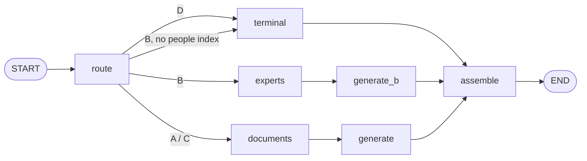
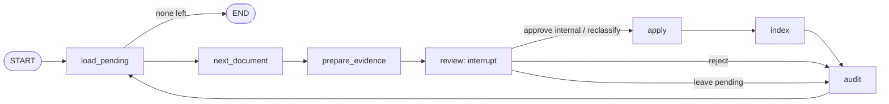

# Tessera — Phase 4.5 Plan (Claude Code Brief)

**Status: DRAFT 2026-10-03, for user review.** Not adopted; nothing in
it is built. Revised the same day after an independent plan review (a
Plan-agent pass against the real code): five blocking and ten
should-fix findings, all addressed below and listed in §12. Decisions
made before drafting are in §11; the open ones are in §10.

Phase 4 is complete and tagged `v0.4.0`. One acceptance check stays open
by user decision: P4-2's live sweep with answers on Bedrock, blocked on
the AWS account. Every gated row of the extended bar passes (exit sweep
2026-10-03, 92/92 cases). Companion documents:
`docs/adr/0006-framework-adoption-adapters-not-core.md` (the architecture
decision this plan carries out), `Tessera_Phase4_Plan.md` (the model for
this document's shape), and `Tessera_Discovery_Findings.md` §4–5 (the
confidentiality model; Legal/General Counsel's role in ethical walls;
the human review pass the headline feature implements).

---

## 0. Context in one paragraph

LangChain and LangGraph appear in nearly every AI/ML and GenAI engineer
job description, and Tessera has neither. It is framework-free by
design: constraint #6 keeps the query path pure, so the Phase 5 Lambda
and the ADR 0002 edge layer can call it without change. Phase 4.5 adds
both frameworks **as adapters, not as a rewrite**, and uses the eval
gate to prove what each one buys:
- **LangGraph** becomes a second orchestrator over the same pure steps.
  It is proven equivalent twice: by replaying recorded model responses
  (exact) and by a live sweep held to the frozen `v0.4.0` bar.
- **LangChain** becomes adapters at the existing ports, in both
  directions. Tessera can use any LangChain chat model, and any LangChain
  code can use Tessera's permission-aware retriever.
- **The headline feature** uses LangGraph for something it does better
  than hand-written code: a **human-review workflow that pauses and
  resumes**. It implements Discovery §5's "only after a human review
  pass" for anonymized case studies. The committed data already shows
  both sides of that problem:
  - the grocer case study is a thinly anonymized Project Halcyon that a
    deterministic check catches;
  - the bank case study is a paraphrased Project Lantern that no
    deterministic check catches.

  The second is why the review is a human's job, as Discovery §4 says.

## 1. Objective and boundaries

**Objective:** four results, each with its own evidence:
1. A pipeline refactor both orchestrators share, proven behaviour-neutral
   by a golden snapshot, before any framework code exists.
2. A LangGraph orchestrator proven equivalent to native, exactly on
   replayed responses and statistically on a live sweep, with a measured
   comparison.
3. LangChain adapters at the `LLMClient` port and around Tessera's
   retrieval, each with an eval or test proving the contract holds
   through the framework.
4. A LangGraph human-review workflow (`tessera corpus review`), whose
   outcomes the leak checks verify, including the case they can't catch.

**In scope:**
- **Machine-readable eval output** (`tessera eval --json`) and a **golden
  retrieval snapshot**. The snapshot is deterministic and makes zero LLM
  calls; it is taken at `v0.4.0` before the refactor (§3.1).
- `pipeline.py` split into named, pure steps plus a `PipelineRun` that
  carries what the harness scores (§3.1). The harness then runs the real
  orchestrator instead of re-composing the steps, closing a gap open
  since Task 7 (the harness's module docstring).
- `orchestration/`: `native.py` (today's sequence) and `langgraph.py` (a
  `StateGraph` over the same steps), behind one `Orchestrator` protocol,
  selected by `TESSERA_ORCHESTRATOR=native|langgraph` in the CLI, the API
  and `tessera eval`.
- `generation/langchain.py`: `LangChainLLMClient`, wrapping any LangChain
  `BaseChatModel` behind `LLMClient`, token usage included.
- `integrations/langchain_retriever.py`: `TesseraRetriever`, a LangChain
  `BaseRetriever` over `retrieve()`, with a `Principal` bound at
  construction.
- A `VectorStore.delete_document()` port method (§3.4.4), so indexing a
  single document can't leave stale chunks behind.
- `review/` and `tessera corpus review`: the review graph with
  `interrupt`, persisted by a SQLite checkpointer, reviewer-scoped
  evidence, a reviewer role in the wall data, an audit log, and
  single-document indexing.
- A **context-marker leak check**: engagement facts in the retrieved
  context, not only in the answer (§3.4.6).
- A written comparison, `docs/Tessera_Orchestration_Comparison.md`
  (§3.5).

**Explicitly NOT in Phase 4.5:**
- Rewriting retrieval or generation on LangChain's retrievers, chains or
  LCEL. The tuned pipeline stays (ADR 0006).
- The LangGraph checkpointer as **conversation memory**: multi-turn
  context stays on CLAUDE.md's do-not-build list. The checkpointer is
  used only to pause and resume a review.
- LangSmith replacing Tessera's traces. An optional callback is decision
  §10.4.
- Agents and tool calling: autonomous tool loops, a ReAct agent, or
  LangGraph's prebuilt agents. They are out of scope for this phase:
  nothing in the four archetypes calls for one yet.
- **Automated identifiability detection.** The review shows similarity
  evidence without a verdict and without a threshold that blocks
  anything (§3.4.3). Discovery §4 says detection must not be presented as
  a solution, and the bank case study (§3.4.7) shows why.
- Anything else on CLAUDE.md's do-not-build list: archetype D, real
  authentication, a chat UI, AWS.

## 2. What does not change

- The pure steps themselves: `route()`, `retrieve()` (permission and
  freshness filters included), `find_experts()`, `generate_answer()` and
  `generate_expertise_answer()`. Their code and prompts are untouched;
  the refactor moves composition, not logic.
- The eval cases and every threshold of the quality bar. Phase 4.5 adds
  rows and one-time acceptance checks (§4); it changes no threshold.
- The default orchestrator stays `native` until the user decides
  otherwise on the comparison's evidence (§10.1).
- The judge stays on Nemotron (NIM).
- Both case studies stay **pending** in the committed corpus. The main
  bar never depends on a review outcome; review scenarios run on a
  temporary copy (§3.4.7).

## 3. Features

### 3.1 A baseline you can diff, then shared pipeline steps (P4.5-2)

**The problem with "reproduce `v0.4.0`" as P4.5-2 first stated it:**
- No machine-readable `v0.4.0` sweep exists. `format_report` doesn't
  even print each case's retrieved documents.
- Retrieval depends on the *routed* archetype, and the router flips on
  some questions (checkpoint Notes: Project Cobalt).
- Marker leaks and the no-match check depend on model output, so they
  aren't deterministic.

So the baseline is built first, at `v0.4.0`, before any refactor:

- **`tessera eval --json PATH`** writes every `CaseResult` field per
  case, alongside the text report.
- **The golden retrieval snapshot** (`evals/snapshot.py`): every case run
  with its archetype **forced** (no routing call) and a scripted fake LLM
  (no generation call). Per case it records retrieved document paths,
  chunk ids and scores, the chunks over the floor, `restricted_seen`, the
  superseded fields, the context-marker hits (§3.4.6), the expertise
  shortlist, and the generation-call count. Deterministic, zero LLM
  calls, committed as `evals/snapshots/v0.4.0.json`.

**The refactor:**
- `pipeline.py` exposes the steps as pure functions over a typed state
  (route; terminal response; expertise; documents → generate; assemble
  the `AnswerResult` and its `Trace`).
- **`PipelineRun`** = `AnswerResult` plus the internals the harness
  scores: the `RetrievalResult`, the shown chunks, the `GeneratedAnswer`
  or `ExpertiseResult`, and **separate routing and generation usage**.
  The pipeline always keeps two recorders, even when one client does
  both. Today one recorder is shared by default (`pipeline.py`), so
  "zero generation calls" can't be read from it. That is why the harness
  wraps the generator in its own `_CountingLLM`. `generation_calls`
  counts metered and unmetered calls both; `_CountingLLM` then goes
  away.
- `answer_query()` becomes `run_pipeline(...).result` with an unchanged
  signature. P4.5-2 introduces the `Orchestrator` protocol with
  `native` as its only implementation, and the harness calls
  `run_pipeline()` through it.

**Proof of neutrality:**
1. The golden snapshot after the refactor is **byte-identical** to
   `v0.4.0.json`.
2. A live sweep passes every gated row.
3. Its `--json` is diffed against the `v0.4.0` export on deterministic
   fields only, and only for cases routed the same in both. Re-routed
   cases are listed separately; the snapshot already covers their
   retrieval.

### 3.2 LangGraph orchestrator (P4.5-3)

- `StateGraph` over a `TypedDict` state holding the query, the principal
  and each step's output, all plain data. Conditional edges come from the
  router's decision and the presence of the people index.
- **Dependencies are per-invocation context, not state or closures.**
  The LLM clients, embedder and stores are passed in at each `invoke`
  through LangGraph's runtime context (`context_schema` / `Runtime`, the
  current replacement for `config["configurable"]`). Usage recorders are
  created there too, per invocation, never at graph build time. A graph
  compiled once and served by the API would otherwise mix usage across
  concurrent requests. The P4.5-1 spike confirms the exact API on the
  pinned version.
- No checkpointer on the question path; each question is answered
  independently.
- Node events from `graph.stream()` can become per-step timings in the
  trace, added only if the comparison shows they're useful (§3.5).
- **Equivalence, three ways:**
  1. **Fakes:** for every path (each archetype; no principal, walled and
     cleared; nothing over the floor; no people index; a superseded
     match), the same fakes give identical `PipelineRun`s from both
     orchestrators. Two concurrent invocations keep their usage apart.
  2. **Replay, exact, on real data:** during the P4.5-2 sweep, native's
     model responses are recorded, keyed by (system, user) prompt. The
     LangGraph orchestrator then runs every case against the recording,
     with no live calls. Its `PipelineRun`s must match native's
     **exactly**. This is what ADR 0006's "must match native" means.
  3. **Live:** a full sweep on `langgraph` passes the bar, with the same
     route-matched diff as §3.1.

### 3.3 LangChain adapters (P4.5-4)

#### 3.3.1 `LangChainLLMClient`
An `LLMClient` over any `BaseChatModel`:
- `complete()` sends a `SystemMessage` and a `HumanMessage`;
  `complete_with_usage()` maps `AIMessage.usage_metadata` into Tessera's
  `Usage`, so cost accounting works through it.
- "Any `BaseChatModel`" is proven in tests with langchain-core's fake
  chat models.
- **Live provider `langchain-nvidia`** uses `ChatNVIDIA` from
  `langchain-nvidia-ai-endpoints`, with the same NIM model and key. A fair
  comparison with `NvidiaClient` needs the same request:
  - `enable_thinking: False` through the equivalent of `extra_body`;
  - the same `max_tokens`, because ChatNVIDIA's default may be lower and
    could truncate synthesis answers;
  - the same temperature.

  `RetryingLLMClient` retries only on exceptions that carry a
  `status_code`. The adapter translates ChatNVIDIA's errors into that
  shape, so NIM's 429s are retried, not turned into ERROR rows. The
  P4.5-1 spike checks each of these.
- **`langchain-bedrock`** (`ChatBedrockConverse`) is written and
  unit-tested only, with a caveat stated in the code and README. It uses
  the bedrock-runtime **Converse** API, which needs different IAM actions
  and possibly different model availability from Tessera's Mantle
  endpoint (`bedrock-mantle:CreateInference`, `generation/bedrock.py`).
  It goes live, if ever, with the Bedrock account.
- **Evidence:** a full sweep with answers through `langchain-nvidia`
  passes the bar, compared with a native NIM sweep (same model, so any
  difference is the framework's). The comparison records added latency
  and tokens.

#### 3.3.2 `TesseraRetriever`
A LangChain `BaseRetriever` whose `_get_relevant_documents(query, *,
run_manager)` calls `retrieve()` with the `Principal` it was built with
and an archetype (default A). It returns LangChain `Document`s whose
metadata carries the citation fields, `sensitivity` and `engagement`.
- **Grounded by default:** it applies the generation floor
  (`filter_relevant`) unless built with `apply_relevance_floor=False`.
  `retrieve()` returns below-floor chunks, which Tessera's own generator
  drops, but third-party chains would otherwise receive them.
- **No permission logic of its own:** it inherits the store filter and
  the Python re-check.
- **Evidence:** a test runs every leakage question through it as the
  walled analyst and finds zero restricted documents and no
  context-marker hits. As the cleared partner it finds the engagement
  document. One README example shows it inside a LangChain chain.

### 3.4 Human-review workflow (P4.5-5)

#### 3.4.1 Who may review
Discovery §4: Legal/General Counsel sets up the information barriers.
`data/access/walls.yaml` gains a **`reviewers:`** list (generated, like
the walls, with the drift test extended). It names who may run a review
at all; today any `--as` could approve anything. The generator adds a
reviewer persona cleared for every engagement, and a second reviewer
cleared for only some, for the escalation case. `tessera corpus review
--as` is a demo identity, like every `--as`.

#### 3.4.2 The graph

- `review` calls `interrupt(payload)` and the run **stops**. `tessera
  corpus review` shows the payload, and the reviewer's decision resumes
  it via `Command(resume=decision)`.
- **Persistence:** a SQLite checkpointer (`langgraph-checkpoint-sqlite`,
  `data/review/checkpoints.sqlite`, gitignored). `thread_id` is
  `review-<reviewer>-<UTC date>`. `--resume` continues the reviewer's
  latest open thread; `--reset` closes it and clears the rejection
  record. This is what the checkpointer is for in this phase, and the
  only thing.
- **Safe to resume.** LangGraph re-runs an interrupted node from its
  start on resume, so `review` has no side effects. `apply`, `index` and
  `audit` are **idempotent**, keyed on a decision id plus the document's
  content hash. On resume the hash is re-checked: if the file changed
  while the review was paused, its evidence is rebuilt and the reviewer
  decides again. Checkpointed state holds only plain JSON types.
- **Decisions** (each needs a short reason):
  - approve as internal;
  - reclassify as restricted to engagement X (X must exist in the walls);
  - reject;
  - leave pending.
- **Where rejection lives:** `review_status` has no "rejected" value
  today, and adding one would mean editing the corpus to record a "no".
  A rejection is recorded in the audit log, so the document is never
  offered again unless `--reset`. The audit log is local data (decision
  §10.3), so on a fresh clone a rejected document is pending again. That
  is stated plainly.
- **Constraint #6:** review nodes do file and index I/O by design, so
  `review/` is exempt from the no-I/O rule, the way `loader.py` is. It
  stays parameterized (paths and dependencies come from the composition
  root) and never touches the query path.

#### 3.4.3 What the reviewer is shown: evidence, not a verdict
`prepare_evidence` collects, deterministically:
- the document's front matter and full text;
- P4-4's data-quality checks. Near-duplicates need the pending document
  embedded on the fly, because `data-report` covers only indexable
  documents;
- its **top-N most similar existing documents with scores**, always N,
  with **no threshold and no "identifiable" label**.

The reviewer reads the evidence and decides. Under the list, the screen
says: *"Similarity is evidence, not clearance. A document with no close
match can still be identifiable to an insider."* The bank case study
(§3.4.7) is the proof.

#### 3.4.4 Evidence is reviewer-scoped, and so is the right to decide
Similar documents and near-duplicate pairs are shown in full only when
they are internal, or restricted to an engagement the reviewer is
cleared for. The rule that decides what a reviewer may do is a
**permission rule, not a similarity rule:** you can't rule on what you
can't inspect.
- A reviewer **cleared for every engagement** sees everything and may
  approve, reclassify, reject or leave pending.
- A reviewer **not cleared for every engagement** sees the same
  "**needs a fully cleared reviewer**" notice on *every* pending
  document, whatever it resembles, and may only leave it pending. The
  notice is identical everywhere, so it doesn't reveal which documents
  resemble restricted material. That is the same reasoning that keeps
  the restricted-chunk count out of the asker's trace (`api.py`).

#### 3.4.5 Applying a decision, and the store port
- `apply` writes `review_status: reviewed` (plus `sensitivity` and
  `engagement`) into the document's front matter. It goes through a small
  pure function over the front-matter text, so the diff is minimal and
  testable.
- **Stale chunks:** `VectorStore` has no delete, Chroma only upserts, and
  chunk ids are `stem::index`. If a re-indexed document ends up with
  fewer chunks, the leftovers keep their **old metadata**, and an old
  *internal* label is a leak path.
  - `VectorStore` gains **`delete_document(document_path)`**. It is a port
    change, so it is named under constraint #1 and implemented for
    Chroma.
  - `index` (single-document, `ingestion/indexing.py`) deletes the
    document's chunks, then adds the new ones.
  - `tessera ingest` moves to the same delete-then-add per document, and
    removes chunks of documents that are no longer indexable (rejected
    or pending again).
- `audit` appends the decision (decision id, document, content hash,
  decision, reviewer, reason, time) to `data/review/audit.jsonl`.

#### 3.4.6 The context-marker leak check
Today a forbidden marker counts as a leak only when it appears in the
**answer**. A document wrongly approved as internal carries no restricted
label, so the chunk check passes it, and only the model's wording would
expose it. Phase 4.5 adds a deterministic, zero-call check on the
**retrieved context**: every chunk in `retrieval.results`, the same
scope as `restricted_seen`.

- **Only engagement markers are checked in context.** The injection
  case `ac-i04` lists the canary phrase `CANARY-OVERRIDE-4417`, which is
  planted on purpose in the internal workshop document it is built to
  retrieve. A context check would flag it every time.
- Case files therefore split markers by kind:
  - `forbidden_markers` becomes a mapping of engagement → its facts;
  - a separate **`canary_markers`** field holds phrases checked in the
    **answer only**.
- A context hit counts as a leak only when the principal isn't cleared
  for the marker's engagement.
- A scan of the committed corpus (review, 2026-10-03) found engagement
  markers outside restricted documents only in the pending grocer case
  study, which is never indexed. So the committed bar stays green.

It is a **separate, new gated row** (§4), not a redefinition of the
existing leak row. Gating it needs the user's sign-off (§10.5).

#### 3.4.7 Evidence: the review scenarios
`evals/review_scenario.py`. Retrieval only: each case's archetype is
forced and no LLM is called. It runs against a temporary copy of the
corpus and the index.

1. **Approve the grocer case study as internal.** Expected:
   context-marker leaks on **`ac-l01` and `ac-l13`** (Halcyon's
   `2,800 stores` reaching the walled analyst and the Kestrel-only
   partner through an "internal" document). The scenario asserts those
   case ids exactly. This is the failure the review gate prevents, shown
   happening.
2. **Reclassify it as restricted to Halcyon instead.** Expected: no
   leaks, and `c0048` (cleared for Halcyon) retrieves **the case study
   itself**.
3. **Reject it.** Expected: not indexed; not offered on the next run.
4. **Approve the bank case study as internal.** Expected: **no detected
   leak**, even though it is a paraphrased Project Lantern ("around 400
   branches", "nearly a hundred") that contains none of Lantern's
   markers. This is the honest-limits case: deterministic checks catch
   copied facts, not paraphrase. It is why the decision is a human's
   (Discovery §4), and the write-up says so.
5. **A reviewer not cleared for every engagement** gets the uniform
   notice on both documents, sees no restricted text, and can't approve.
6. **Interrupted and resumed:** a review stopped mid-way resumes in a
   new process at the same document. Each decision is applied once, even
   if a resume re-runs a node.

The scenarios run as tests and as a recorded run whose output goes in
the P4.5-5 PR. The graph's Mermaid export (`draw_mermaid()`) is committed
beside it.

### 3.5 The comparison (P4.5-6)

`docs/Tessera_Orchestration_Comparison.md` sets native and LangGraph
side by side on measured evidence:
- **Quality:** the replay-equivalence result, the bar rows from both live
  sweeps, and the route-matched per-case diff.
- **Latency:** orchestration overhead per question, measured with a fake
  LLM so the milliseconds aren't buried under seconds of model time; and
  end to end.
- **Code and weight:** lines and modules per orchestrator; dependencies
  added; installed size of the native-only environment versus the
  framework extra. There's no container image until Phase 5, so installed
  size is the proxy.
- **What LangGraph made easier:** the review workflow's durable pause and
  resume, routing as data, streaming node events.
- **What it cost:** the weight, a second way to run the same thing,
  version churn, the runtime-context indirection.
- **A recommendation**, for the user to decide (§10.1).

It is written to be read cold by a reviewer or an interviewer: what was
tried, what was measured, what was decided and why.

## 4. Evaluation

**New permanent rows in the bar:**

| Row | Threshold | Gated | Enters |
|---|---|---|---|
| Context-marker leaks (engagement facts in retrieved context, uncleared principal) | 0 cases | yes, after sign-off (§10.5) | P4.5-5 |

**One-time acceptance checks** (recorded in the PRs, not bar rows):

| Check | Requirement | Task |
|---|---|---|
| Golden retrieval snapshot after the refactor | byte-identical to `v0.4.0.json` | P4.5-2 |
| Orchestrator equivalence on fakes (every path, concurrent usage) | identical `PipelineRun`s | P4.5-3 |
| Replay equivalence on real recorded responses | identical `PipelineRun`s | P4.5-3 |
| `langgraph` live sweep | every gated row passes | P4.5-3 |
| `langchain-nvidia` live sweep | every gated row passes | P4.5-4 |
| `TesseraRetriever` leak test | 0 restricted, 0 context markers, walled | P4.5-4 |
| Review scenarios (§3.4.7) | as specified, case ids exact | P4.5-5 |

`tessera eval --orchestrator langgraph` and `TESSERA_LLM_PROVIDER=
langchain-nvidia` run the sweeps. CLAUDE.md's rule that a PR touching the
query path pastes a fresh `tessera eval --check` applies unchanged. A PR
that changes an orchestrator, or the pipeline steps they share, pastes
sweeps on **both** orchestrators.

**Sweep budget** (NIM free tier, ~250 calls and 21–46 minutes per full
sweep):
- `v0.4.0` baseline export (P4.5-2);
- native after the refactor, with responses recorded (P4.5-2);
- `langgraph`, with native re-checked (P4.5-3);
- `langchain-nvidia`, with a native NIM sweep beside it (P4.5-4);
- both orchestrators after the context-marker row and the store change
  (P4.5-5);
- both exit sweeps (P4.5-6).

That is about **10–12 full sweeps** across the phase, a few per task and
never close to the daily limit. Replay equivalence and the golden
snapshot make zero calls. A Bedrock sweep, if the account unblocks,
states its cost first (CLAUDE.md).

## 5. Task sequence

### P4.5-1 — Adopt the plan; dependencies; spike
This plan and ADR 0006 adopted; CLAUDE.md updated (§9). Add the
dependencies in the form chosen in §10.2:
- `langgraph`
- `langgraph-checkpoint-sqlite`
- `langchain-core`
- `langchain-nvidia-ai-endpoints`
- `langchain-aws`

**Spike first, on this repo's Python (3.14.4). Throwaway code; results
recorded in the checkpoint:**
- **Install:**
  - every package resolves on 3.14;
  - `uv sync` stays CPU-only: `grep -cE '^name = "nvidia-' uv.lock` is
    0. Not `grep -c 'nvidia-'`, which matches
    `langchain-nvidia-ai-endpoints` itself.
- **LangGraph:**
  - a two-node graph whose `interrupt` is resumed with
    `Command(resume=…)` from a SQLite checkpointer in a **fresh
    process**;
  - the runtime-context API (`context_schema` / `Runtime`) on the pinned
    version;
  - re-execution of the interrupted node on resume;
  - the checkpoint serializer's allowed types.
- **ChatNVIDIA:**
  - `usage_metadata` populated;
  - how to send `enable_thinking: False`;
  - its default `max_tokens`;
  - the exception types on 429/5xx (for the retry adapter).
- **`BaseRetriever`:** a subclass with `_get_relevant_documents(query, *,
  run_manager)`.
- **Fake chat models** in langchain-core.

**Acceptance:**
- dependencies locked, and the CPU-only check passes;
- the spike results recorded, along with every place the plan's
  assumptions differed;
- the suite green on a native-only install too (framework tests use
  `pytest.importorskip`).

If a dependency doesn't support 3.14, the plan is revised before P4.5-2.

### P4.5-2 — Baseline, shared steps, `PipelineRun`, harness through the orchestrator
§3.1.
1. At `v0.4.0` (before refactoring): `tessera eval --json`, the golden
   snapshot (`evals/snapshots/v0.4.0.json`), and a baseline sweep
   exported as JSON.
2. The refactor: pipeline steps, `PipelineRun` with split recorders, the
   `Orchestrator` protocol with `native`, the harness through it, and
   `_CountingLLM` removed.
3. A native sweep with response recording on.

**Acceptance:**
- the snapshot is byte-identical;
- the native sweep passes every gated row;
- the route-matched per-case diff against the baseline is in the PR,
  with re-routed cases listed;
- `answer_query()`'s signature is unchanged.

### P4.5-3 — LangGraph orchestrator
§3.2. `orchestration/langgraph.py`, `TESSERA_ORCHESTRATOR`, and
`tessera eval --orchestrator`.

**Acceptance:**
- the fake equivalence tests pass on every path, including concurrent
  usage isolation;
- replay equivalence is exact on every case;
- the `langgraph` live sweep `=> PASS`, with the route-matched diff in
  the PR.

### P4.5-4 — LangChain adapters
§3.3.

**Acceptance:**
- fake-model tests pass;
- the `langchain-nvidia` sweep `=> PASS`, with request parity verified
  (thinking off, `max_tokens`, retries on 429);
- the `TesseraRetriever` leak test passes;
- the README example runs.

### P4.5-5 — Human-review workflow
§3.4: the reviewers list, `tessera corpus review [--as] [--resume]
[--reset]`, the graph, reviewer-scoped evidence, `delete_document` and
delete-then-add indexing, the audit log, the marker split
(`forbidden_markers` per engagement + `canary_markers`), and the
context-marker check.

**Acceptance:**
- all six review scenarios (§3.4.7) behave as specified, as tests and as
  a recorded run;
- a new test shows a re-indexed document that shrinks leaves no stale
  chunks;
- after sign-off, sweeps on both orchestrators with the context-marker
  row gated `=> PASS`.

### P4.5-6 — Comparison and Phase 4.5 exit
§3.5. The comparison document; the README (what Phase 4.5 added, the
LangChain retriever example, the review workflow, honest limits);
QUALITY_BAR; the checkpoint close entry; the Phase 1 exit criteria
re-confirmed on a fresh clone; final clean sweeps on both orchestrators.

**Acceptance:**
- both exit sweeps pass the bar;
- the comparison is written;
- the user has decided the default orchestrator and the one Phase 5
  deploys (§10.1);
- the tag (§10.6) is cut and pushed.

## 6. Notes and risks

- **Python 3.14 support.** Some integration packages may lag new Python
  releases. The P4.5-1 spike finds out first. A fallback (pin versions,
  or run on 3.13) is a user decision, not a silent change.
- **Version churn.** Everything is pinned in `uv.lock`, the adapters stay
  thin, and the comparison names churn as a cost.
- **Refactor risk (P4.5-2).** It touches the most load-bearing code in
  the repo, which is why a golden snapshot and a baseline export exist
  before the first line moves.
- **The import boundary is an allow-list.** Only `generation/langchain.py`,
  `orchestration/langgraph.py`, `integrations/` and `review/` may import
  `langchain*` or `langgraph*`; a test walks `src/tessera/` and enforces
  it. A subprocess test then imports `tessera.pipeline`, `tessera.cli` and
  `tessera.api` and asserts no `langchain*` or `langgraph*` module was
  loaded. That is what keeps the optional extra genuinely optional
  (§10.2).
- **The reviewer role leaks nothing, but it is still a demo identity.**
  `tessera corpus review --as` is as unauthenticated as every `--as`; the
  review screen and the README say so.
- **Writing to the corpus.** `apply` edits committed files, only after a
  decision, through a tested pure function. Under the default (§10.3)
  scenarios write to a temporary copy, and a live review's edits are the
  user's to commit or discard.
- **Similarity is shown, never trusted.** The bank case study is in the
  scenarios precisely so that no one, including this project's own
  write-up, can overclaim what the evidence catches.
- **Command naming.** `tessera feedback review` already exists, so the new
  command is `tessera corpus review`, to keep the two kinds of review
  apart.

## 7. Prerequisites

- None on AWS. NIM is the provider throughout. The Bedrock and Converse
  adapters are unit-tested only, as P4-2's was.
- If the Bedrock account unblocks during Phase 4.5, P4-2's live sweep
  (still open from Phase 4) runs as a side task with its cost stated
  first, and Bedrock latency feeds the deferred chat-UI decision.

## 8. Phase 5 (unchanged, next)

The ephemeral AWS deployment as `Tessera_Phase4_Plan.md` §9 describes
it, deploying the orchestrator the user picks at P4.5-6 (§10.1).

## 9. What changes in CLAUDE.md when this plan is adopted

- **`docs/` list:** this document described as Phase 4.5; ADR 0006
  noted.
- **Technology table:**
  - an orchestration row (native composition, plus LangGraph as a
    config-selected alternative);
  - LangChain adapters noted on the LLM row;
  - a review-workflow row (LangGraph `interrupt` + SQLite checkpointer);
  - `VectorStore.delete_document` noted on the vector-store row.
- **Constraint #1:** `VectorStore` gains `delete_document`.
- **Constraint #6:**
  - the framework allow-list;
  - graph nodes are pure functions over plain state, with dependencies
    passed as per-invocation runtime context;
  - `review/` is exempt from the no-I/O rule, like `loader.py`, and stays
    parameterized.
- **Do-not-build list:**
  - "conversation memory" notes that the LangGraph checkpointer is used
    only for review pause and resume;
  - agents and tool loops are out of scope for Phase 4.5;
  - "automated identifiability detection" notes that the review shows
    similarity evidence without a verdict.
- **Working conventions:**
  - a change to an orchestrator or the shared pipeline steps pastes
    sweeps on both orchestrators;
  - the bar-check trigger list gains `orchestration/`.

## 10. Decisions for the user (before or during the phase)

1. **Default orchestrator, and the one Phase 5 deploys.** Decided at
   P4.5-6 on the comparison's evidence; until then, `native`.
2. **How the frameworks are installed:** core dependencies, or an
   optional extra (`uv sync --extra langchain`) so the native-only
   install and the Phase 5 image stay lean. *Recommendation: an optional
   extra. The native path must not need it, and the subprocess import
   test (§6) enforces that.*
3. **Review outputs:** commit the audit log and the front-matter edits a
   live review produces (a reviewable record in git), or keep them as
   local runtime data like traces? *Recommendation: local by default.
   Scenarios run on a temporary copy, the committed case studies stay
   pending, and the README shows how to run a review.*
4. **LangSmith:** an optional callback that also sends traces there, or
   leave it out. *Recommendation: leave it out. Tessera's own traces are
   the point, and LangSmith adds an external service and a key.*
5. **The context-marker check (§3.4.6) as a new gated row.** Adding a
   gated row needs sign-off per `QUALITY_BAR.md`. *Recommendation: yes.
   It's stricter, deterministic and free, and it's what makes the review
   scenario's failure case visible without relying on the model's
   wording.*
6. **Tag name:** `v0.4.5`, leaving `v0.5.0` for Phase 5.
   *Recommendation: `v0.4.5`.*

## 11. Decisions made before drafting (user, 2026-10-03)

1. **Phase 4.5 comes after `v0.4.0`** and before Phase 5, as its own
   phase with this plan.
2. **Adapters, not a core rewrite.** LangGraph as an alternative
   orchestrator held to the same bar; LangChain adapters behind the
   existing ports.
3. **The graph-shaped feature is the human-review interrupt** for
   quarantined documents. A corrective-retrieval loop was the
   alternative and was not chosen.
4. **Portfolio quality over speed:** no task is shrunk to save time; the
   thorough version, with evidence, is the default.
5. **The plan is reviewed by a Plan-agent pass before adoption** (done:
   §12).

## 12. Plan review (2026-10-03) and how each finding was addressed

An independent Plan-agent review read this draft, ADR 0006 and the code.
Verdict: *adopt after revision*. The architecture stands; five findings
were blocking.

| # | Finding | Resolution |
|---|---|---|
| B1 | The context-marker check would fail `ac-i04` permanently: its canary is planted in an internal document it retrieves | Markers split into per-engagement `forbidden_markers` plus answer-only `canary_markers`; context hits count only for uncleared engagements (§3.4.6) |
| B2 | `grep -c 'nvidia-' uv.lock` matches `langchain-nvidia-ai-endpoints` itself | The check is `grep -cE '^name = "nvidia-'` (§5 P4.5-1) |
| B3 | "Identical to `v0.4.0` per case" was uncheckable: no JSON export, re-routing, LLM-dependent fields | `--json` export, a golden snapshot with forced archetypes and zero calls taken before the refactor, and a route-matched live diff (§3.1) |
| B4 | One usage recorder shared by default; "zero generation calls" unreadable | `PipelineRun` keeps separate routing and generation usage; `_CountingLLM` retired (§3.1) |
| B5 | Recorders bound at graph build time would mix usage across concurrent API requests | Dependencies and recorders passed per invocation through the runtime context; a concurrency test (§3.2) |
| S1 | Upsert-only store leaves stale chunks with old labels | `VectorStore.delete_document`; delete-then-add in both indexing paths (§3.4.5) |
| S2 | "Resembles restricted material…" reveals existence to an uncleared reviewer | A reviewers list grounded in Discovery §4's Legal/GC role; a uniform notice on every document for partially cleared reviewers (§3.4.1, §3.4.4) |
| S3 | A thresholded resemblance gate is automated identifiability detection used as a control | Top-N with scores, no threshold, a "not clearance" note; the gate is a permission rule; the bank case study as the honest-limits scenario (§3.4.3, §3.4.7) |
| S4 | The scenario's expected leaks were loosely stated | Exact case ids (`ac-l01`, `ac-l13`); archetype forced; "context" defined as `retrieval.results`; the cleared partner retrieves the case study itself (§3.4.7) |
| S5 | Resume re-runs the interrupted node; thread ids, hashes, rejection, I/O exemption unspecified | A side-effect-free `review` node, idempotent effects keyed on decision id + hash, a thread-id scheme, a hash re-check, JSON-only state, rejection in the audit log, `review/` exempt (§3.4.2) |
| S6 | Near-duplicate evidence would name restricted documents; pending documents aren't in `data-report`'s set | Evidence reviewer-scoped; the pending document embedded on the fly (§3.4.3, §3.4.4) |
| S7 | Unfair ChatNVIDIA comparison (thinking, `max_tokens`) and retries that wouldn't fire | Request parity and an error-translating adapter; all of it checked in the spike (§3.3.1, §5) |
| S8 | `ChatBedrockConverse` is not like-for-like with the Mantle client | Stated; "any `BaseChatModel`" proven with fake chat models (§3.3.1) |
| S9 | A deny-list import test misses modules | An allow-list plus a subprocess import test; `importorskip` for a native-only install (§6, §5) |
| S10 | `TesseraRetriever` would hand third-party chains below-floor chunks | The relevance floor applied by default (§3.3.2) |
| N | Replay equivalence; §4 mixed bar rows and one-time checks; sweep count too low; small fixes | Replay added (§3.2); §4 split; budget restated as 10–12; B "no index" branch drawn; protocol introduced in P4.5-2; installed size as the proxy; `tessera corpus review`; Mermaid export committed |
