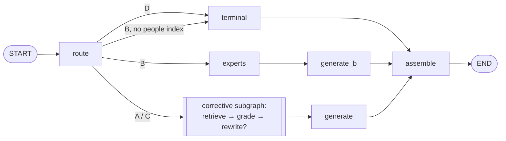

# Tessera — Phase 5 Plan: LangChain, LangGraph, LangSmith (Claude Code Brief)

**Status: ADOPTED 2026-10-05** (user). Nothing in it is built yet. It
has been through two independent plan reviews (Plan-agent passes against
the real code). Every finding from both is addressed, and §12 and §13 map
each one to the place in this plan that deals with it. **Amended at
adoption for ADR 0007** (2026-10-05): the cloud is Google Cloud and the
production LLM is Gemini on Agent Platform, so the Bedrock pieces became
Gemini ones, and Phase 6 deploys to Cloud Run with a chat UI (§8, §11).
§14 reviews the amendments.

**History.** This began as a narrow "Phase 4.5" draft: the frameworks
only where they earn their place. After its first review, the user reset
the goal (§11): **learn LangChain, LangGraph and LangSmith thoroughly by
using them across Tessera, whether or not a layer strictly needs them**,
as a full phase. Everything from the first draft and its review that
still applies is carried into this one. The rescoped draft was then
reviewed again (§12).

Phase 4 is complete and tagged `v0.4.0`. Its one open acceptance check,
P4-2's live sweep, was blocked on the AWS account and runs on Gemini
instead (ADR 0007).
Numbering after this plan:
- **Phase 5** is this plan (`v0.5.0`);
- **Phase 6** is the ephemeral Google Cloud deployment (Cloud Run, with
  a chat UI; `Tessera_Phase4_Plan.md` §9's principles, on GCP per ADR
  0007);
- **Phase 7** is CI/CD with the eval gate, plus monitoring.

Companion documents:
- `docs/adr/0006-framework-adoption-parallel-langchain-stack.md`;
- `Tessera_Discovery_Findings.md` §4–5 (the confidentiality model,
  Legal/General Counsel's role in ethical walls, the human review pass);
- `evals/QUALITY_BAR.md`;
- `evals/tune_retrieval.py` (the tuning discipline this phase reuses).

---

## 0. Context in one paragraph

LangChain, LangGraph and LangSmith are the market's default stack for LLM
applications, and the goal of this phase is hands-on depth in all three.
Tessera is an unusually good place to learn them. Every layer already has
a hand-built, tuned, eval-measured implementation, so each framework
version can be **measured against a known baseline, layer by layer**, by
the same harness against the same bar.

The phase builds a complete **parallel LangChain stack**:
- loaders and splitters, embeddings, the Chroma integration, and the
  indexing API;
- retrievers: parent-document, BM25 hybrid, multi-query, and a local
  reranker;
- prompt templates, Runnables and LCEL, structured output, and callbacks.

**LangGraph** orchestrates it and **LangSmith** observes and evaluates
it. The native core stays untouched as the baseline. Every LangChain
component can be switched independently, so the evidence is an
**ablation**: what each component changed in quality, latency, cost and
code, measured against a known noise floor. Beyond orchestration,
LangGraph runs two features:
- a **corrective retrieval loop** (grade, rewrite, retry; no tools);
- the **human-review workflow**, using `interrupt` and a checkpointer, for
  quarantined case studies.

Confidentiality carries over into the framework world, and that is where
frameworks make it easy to lose:
- the permission filter must hold before ranking in every retriever,
  in-memory BM25 included;
- nothing restricted or quarantined may leave the machine in a LangSmith
  trace or dataset.

## 1. Objective and boundaries

**Objective:** six results, each with its own evidence:
1. **One harness, any stack:** a refactor that lets the eval harness score
   any pipeline implementation through one protocol. It is proven
   behaviour-neutral by a golden snapshot taken **before any dependency or
   code changes**.
2. **A parallel LangChain stack**, layer by layer (§3.3–3.6). Each layer is
   measured against native on its own, then all together.
3. **LangGraph** orchestrating that stack, plus a corrective-retrieval
   loop, each measured.
4. **A LangGraph human-review workflow** (`tessera corpus review`), whose
   outcomes the leak checks verify, including the case they can't catch.
5. **LangSmith** tracing for both stacks, plus datasets and experiments
   built from Tessera's eval cases, under a **taint-based redaction policy**
   enforced by a gated test.
6. **A written comparison** of native and LangChain per layer, which the
   user uses to decide what Phase 6 deploys.

**Explicitly NOT in Phase 5:**
- **Agents and tool calling**, and **conversation memory**. Both stay on
  CLAUDE.md's do-not-build list (user, 2026-10-03). LangGraph is used for
  orchestration, conditional routing, a loop without tools, interrupts,
  and a checkpointer for review pause and resume, nothing else.
  - The query graph is compiled **without** a checkpointer.
  - An import test forbids `create_agent`, `langgraph.prebuilt`,
    `ToolNode` and `add_messages` anywhere in `src/`.
  - Structured-output routing prefers JSON-schema / guided-JSON mode. If a
    model needs forced function calling for it, that is a schema
    constraint, not agentic tool use, and CLAUDE.md says so.
- **Replacing the native core.** It stays as the default and the baseline
  (ADR 0006).
- **Automated identifiability detection.** The review shows similarity
  evidence without a verdict (§3.8.3).
- **The cloud deployment and the chat UI** (Phase 6), **CI/CD**
  (Phase 7), archetype D, real authentication, and **LLM caching** in
  any gating sweep (`set_llm_cache` is never used there).

## 2. What does not change

- **The native stack's logic.** `route()`, `retrieve()`, `find_experts()`,
  the generators and their prompts. P5-2 moves composition, not
  behaviour. P5-4 changes native *indexing* (delete-then-add) for
  correctness, and re-takes the snapshot to prove retrieval is unchanged.
- **The quality bar's thresholds.** New rows are added (§4); no threshold
  changes.
- **The judge** stays on Nemotron (NIM), so scores are comparable across
  stacks.
- **The eval cases, the walls and the corpus.** Both case studies stay
  **pending** in the committed corpus, and review scenarios run on a
  temporary copy. One structural change: P5-2 splits markers by kind
  (§3.1.3).
- **`native` stays the default stack** until the user decides otherwise on
  the comparison's evidence (§10.1).

## 3. Design

### 3.1 Baseline first; one harness, any stack (P5-0, P5-2)

The harness re-composes `route` → `retrieve` → `generate` itself today,
because `AnswerResult` doesn't carry what it scores (its module
docstring). Scoring a second stack needs one interface that both
implement.

#### 3.1.1 The baseline, before anything changes (P5-0)
Taken on `main` after ADR 0007's merge, whose NIM path is unchanged since
`v0.4.0`: the lock gained packages (google-genai and its dependencies)
but changed or removed none, and the only change on the shared path
(`resilient._status_code` also reading `code`) leaves openai errors as
they were. Every P5-0 sweep pins `TESSERA_LLM_PROVIDER=nvidia`. P4-2's
live Gemini sweep (2026-10-05) is the Gemini reference point.
It runs **before** P5-1 adds any dependency, because the new
packages may move `transformers` (5.15), `sentence-transformers` (5.7) or
`chromadb` (1.5.9) in the lock and change embeddings:
- **`tessera eval --json PATH`** writes every `CaseResult` field per case.
- **The golden retrieval snapshot** (`evals/snapshot.py`): every case run
  with its archetype **forced** (no routing call) and a scripted fake LLM
  (no generation call). Per case it records:
  - retrieved document paths;
  - chunk ids;
  - scores, **rounded to 4 decimal places**;
  - the chunks over the floor;
  - `restricted_seen` and the superseded fields;
  - the expertise shortlist;
  - the generation-call count.

  Deterministic, zero calls, committed as `evals/snapshots/v0.4.0.json`.
- **A baseline sweep**, exported as JSON. A **second** native sweep
  measures the judge's run-to-run noise (§4.2).

#### 3.1.2 The refactor (P5-2)
- `pipeline.py` exposes the native steps as pure functions over a typed
  state.
- **The native `Pipeline` takes its step functions and ports as
  constructor parameters**, with the core functions as defaults. That is
  what lets P5-3 wrap them with `@traceable` in the composition root
  without editing core modules (today `answer_query` calls module-level
  `route` and `retrieve`).
- **`PipelineRun`** = `AnswerResult` plus what the harness scores:
  - every `RetrievalResult` (a list, because the corrective loop and
    multi-query retrieve more than once);
  - the shown chunks;
  - the generated answer or expertise result;
  - **separate routing and generation usage**.

  It keeps two recorders always, even when one client does both: today
  one is shared by default, so "zero generation calls" can't be read from
  it. `_CountingLLM` goes away.
- **A `Pipeline` protocol**, `run(query, principal) -> PipelineRun`, with
  `native` as its first implementation. `answer_query()` becomes a thin
  wrapper with an unchanged signature.
- **`--stack native|lc`** on the CLI, the API and `tessera eval`;
  `TESSERA_STACK` sets the default.

#### 3.1.3 Markers split, and the context-marker check (P5-2)
This was moved here from the review task, because P5-5's retriever leak
tests and every snapshot after P5-2 depend on it:
- **Two marker fields:**
  - `forbidden_markers` becomes a mapping of engagement → its facts;
  - a separate **`canary_markers`** field holds phrases checked in the
    **answer only**. Without the split, `ac-i04`'s canary, which is
    planted on purpose in the internal workshop document it retrieves,
    would fail a context check every time.
- **A context-marker check:** deterministic and zero-call, over **every
  chunk in every retrieval attempt** (the same scope as `restricted_seen`,
  extended to all attempts). A hit counts as a leak only when the
  principal isn't cleared for the marker's engagement.
- It enters as a **reported** row, gated after the user's sign-off
  (§10.5). A scan of the committed corpus found engagement markers outside
  restricted documents only in the pending grocer case study, which is
  never indexed, so the committed bar stays green.

**Proof of neutrality:**
1. The P5-2 snapshot equals the P5-0 snapshot field for field, with the
   context-marker field added (empty everywhere).
2. A live sweep passes every gated row.
3. Its `--json` is diffed against the baseline on deterministic fields,
   for cases routed the same in both; re-routed cases are listed
   separately.

### 3.2 The LangChain stack: shape, switches, boundaries

`src/tessera/lc/` is a second `Pipeline` implementation. Each layer is a
switch, so any one framework component can be measured with everything
else held native.

#### 3.2.1 The switch matrix

| Switch | Values | Measured | Held fixed |
|---|---|---|---|
| `loader` | native · lc | parity test (metadata identical) | — |
| `splitter` | native · lc (+ size sweep) | retrieval-only | everything else native |
| `embed_prefix` | on · off | retrieval-only | splitter |
| `embeddings` | native · lc | retrieval-only (vectors equal within tolerance) | — |
| `store` | native · lc (`langchain_chroma`) | retrieval-only | — |
| `indexing` | native delete-then-add · lc `index()` + RecordManager | stale-chunk test | — |
| `retriever` | native · lc · parent-doc · hybrid · multiquery · +rerank | retrieval-only (multiquery: live) | generation native |
| `router` | native JSON · lc structured output | live | generation native |
| `prompt_chain` | native · LCEL | live | model client native |
| `model_client` | `NvidiaClient`/`GeminiClient` · `ChatNVIDIA`/`ChatGoogleGenerativeAI`, chosen by `TESSERA_LLM_PROVIDER` | live | prompt_chain lc |
| `retry` | `RetryingLLMClient` · `with_retry` · `InMemoryRateLimiter` · LangGraph `RetryPolicy` | live + fault-injected tests | — |
| `orchestration` | native · LangGraph | fakes + replay (exact); live | all components native |
| `corrective` | off · score · llm | live | chosen defaults |

Config sets each switch (`TESSERA_LC_<SWITCH>`). **Two named profiles are
always swept:**
- **`lc-defaults`**: each switch at the value its evidence chose;
- **`all-lc`**: every switch at its LangChain value.

The comparison reports both, so "the framework, fully" is measured, not
only "the framework, where it won". Defaults move to `lc` only as each
layer passes its check.

#### 3.2.2 Rules the stack keeps
- **Constraint #6:**
  - LangChain objects are built by **lazily imported factories in
    `integrations/`**, which the composition roots (`cli.py`, `api.py`,
    `evals/`) call only when `--stack lc` or LangSmith is selected;
  - graph nodes are pure over plain-data state;
  - dependencies and usage recorders are passed **per invocation** through
    LangGraph's runtime context (`context_schema` / `Runtime`), never in
    state, never bound when the graph is built.
- **An allow-list import boundary:**
  - only `tessera/lc/`, `tessera/review/`, `tessera/integrations/`,
    `tessera/observability/` and `evals/langsmith_sync.py` may import
    `langchain*`, `langgraph*` or `langsmith`;
  - a test walks the tree and enforces it;
  - a **subprocess** test imports `tessera.pipeline`, `tessera.cli` and
    `tessera.api` with the native stack selected, and asserts none of them
    loaded. `langsmith` is a hard dependency of `langchain-core`, so this
    is the test that keeps the frameworks genuinely optional (§10.2).
- **The same corpus and labels.** The LangChain loader reuses
  `front_matter_problems()` and the sensitivity resolution. A test asserts
  identical document metadata from both loaders.
- **Chunk ids keep `<stem>::<n>`** in both stacks (`_chunk_index` depends
  on it).

### 3.3 Ingestion: loaders, splitters, embeddings, store, indexing (P5-4)

- **`TesseraCorpusLoader(BaseLoader)`** yields one `Document` per file with
  the validated front matter, and holds quarantined documents out as
  `indexable()` does. `lazy_load()` is the primary method, and `.batch`
  embedding is used for ingestion throughput.
- **Splitting.** `MarkdownHeaderTextSplitter` (on `#`, `##`, `###`, with
  `strip_headers` set deliberately and recorded, and the header path kept
  in metadata), then `RecursiveCharacterTextSplitter` for oversized
  sections. This is the framework counterpart of `chunker.py`'s
  section-aware split. The comparison records what each does with tables
  and fenced blocks, which the native chunker refuses to split.
- **The embedding-text prefix.** Native embeds title and heading path
  ahead of the body (`chunk_embedding_text`) but stores the body only.
  LangChain's `add_documents` embeds `page_content`, and putting the prefix
  into `page_content` would change the rendered prompt and defeat the
  prompt-identity test. The spike picks the mechanism:
  - precomputed embeddings upserted through the store's client, or
  - prefix-on-write with strip-on-read.

  It is documented, and the `embed_prefix` switch ablates it.
- **Embeddings and store.** `HuggingFaceEmbeddings` (the same
  `all-MiniLM-L6-v2`; a test checks the vectors match native's within
  tolerance) into `langchain_chroma.Chroma`, collection
  `tessera_lc_chunks`, cosine space.
- **Indexing, two ways to learn:**
  1. **Native gets `VectorStore.delete_document()`**, a port change named
     under constraint #1, and moves to delete-then-add, so a document
     whose chunk count shrinks leaves nothing behind with old labels.
  2. **The LangChain stack uses LangChain's `index()` API** with a
     `SQLRecordManager` and `cleanup="incremental"`, LangChain's own answer
     to the same problem.

  The stale-chunk test runs against both, and the comparison sets them
  side by side.
- **Evidence:**
  - retrieval-only comparisons (forced archetypes, zero calls) of splitter
    and prefix variants on recall, MRR, chunk count and size distribution.
    **Tuned on `query_log.yaml`, reported on held-out `placeholder.yaml`**,
    reusing `evals/tune_retrieval.py`;
  - the loader-parity and embedding-parity tests;
  - a re-taken native snapshot after delete-then-add, which must be
    unchanged.

### 3.4 Retrieval: archetype-aware, permission-safe, plus variants (P5-5)

- **`LookupRetriever` and `SynthesisRetriever`** (`BaseRetriever`) rebuild
  the native strategies from LangChain primitives:
  - candidate pool → per-document diversification → top-k;
  - the freshness exclusion and superseded probe;
  - lookup's parent-document expansion, with **LangChain's
    `ParentDocumentRetriever` as a variant** against the native
    `_expand_top_documents`.

  The vector store's `filter=` uses the **same Chroma `where` clauses**
  (permission plus `CURRENT_ONLY`), and every result is re-checked in
  Python.
- **One retrieval contract for every retriever.** Whatever a retriever
  returns (vector, BM25, fused, multi-query union, reranked) goes through
  the same final stage before the generation floor:
  1. **Re-score with cosine similarity**, carried in metadata.
     `EnsembleRetriever` fuses by weighted reciprocal rank, and
     `MultiQueryRetriever` unions with no scores, but `filter_relevant`,
     the superseded cutoff and the score-based grader all need cosine
     scores.
  2. `CURRENT_ONLY`, the superseded probe, the quarantine exclusion and
     `is_permitted`.
- **Permission scope lives in the retriever, not the query.** A
  principal-bound retriever is built per request. Every sub-call, from
  multi-query's rephrasings and the corrective loop's rewrite to the
  grader's look at the context, goes through **that same retriever**. A
  test with a recording fake store asserts every `where` it sees carries
  the principal's permission filter.
- **BM25, the instructive case.** `BM25Retriever` ranks an in-memory
  corpus. A single index over all documents would rank restricted text for
  a walled user before any post-filter ran, breaking "filter before
  ranking" (Phase 4 plan §3.5.4). So:
  - there is **one BM25 index per permission scope**: internal, plus one
    per engagement;
  - a principal's BM25 retriever ranks only over the union of their
    scopes;
  - the indexes are cached per scope set, and **invalidated and rebuilt**
    when a review changes the corpus (§3.8.5).
- **Variants to learn and measure:**
  - **the hybrid**, `EnsembleRetriever` over BM25 and vector, with its
    weights tuned retrieval-only on `query_log.yaml` and reported on
    `placeholder.yaml`;
  - **`MultiQueryRetriever`**, measured live (it calls the LLM), with a
    **`Send` fan-out version in LangGraph** (§3.7) beside it;
  - **a local cross-encoder reranker** (`CrossEncoderReranker` with
    `HuggingFaceCrossEncoder` through `ContextualCompressionRetriever`),
    retrieval-only with zero calls.

  None of them becomes a default without the evidence.
- **Package reality.** In LangChain 1.x, `EnsembleRetriever`,
  `MultiQueryRetriever`, `ParentDocumentRetriever`,
  `ContextualCompressionRetriever` and `SQLRecordManager` live in
  **`langchain-classic`**, which is legacy and in maintenance mode.
  `BM25Retriever` and `HuggingFaceCrossEncoder` live in
  **`langchain-community`**. The plan uses them knowingly, and the
  comparison counts it as a cost: you learn the classic retrievers because
  real codebases use them, not because they're the future.
- **`TesseraRetriever`**: the *native* `retrieve()` exposed as a LangChain
  `BaseRetriever`, with the relevance floor applied by default. It is the
  bridge for third-party chains.
- **Evidence:**
  - retrieval-only recall, MRR and precision per retriever (tuned and
    held-out as above);
  - a **leak test for every retriever** (vector, parent-doc, BM25, hybrid,
    multi-query, reranked, `TesseraRetriever`): every leakage question as
    the walled analyst finds zero restricted documents and zero
    context-marker hits; the cleared partner finds the engagement document.

### 3.5 Generation: templates, Runnables, structured output, callbacks, retries (P5-6)

- **Prompts.** `ChatPromptTemplate`s with the **same text** as
  `prompts.py`. A test renders both and compares them.
- **Runnables, learned on purpose.** The grounded-answer chain is built
  from:
  - `RunnablePassthrough.assign` (attach formatted sources);
  - `RunnableParallel` (sources and question side by side);
  - `RunnableLambda` (the shared `format_source_group`, so the judge's
    numbering stays identical, per the 2026-10-02 lesson);
  - prompt | model | `StrOutputParser`.

  A **`RunnableBranch`** routing variant (archetype → chain) is compared
  with LangGraph's conditional edges, so the same decision is seen in two
  idioms. `.batch` and `astream_events` are exercised. **Time to first
  token** is measured with streaming, which informs whether Phase 6's
  chat UI streams. Fixed messages and the superseded note stay deterministic,
  outside the model.
- **Structured routing.** `with_structured_output(RouteDecision)` (Pydantic,
  JSON-schema or guided-JSON mode preferred) with **`include_raw=True`**.
  Otherwise `usage_metadata` is dropped and cost accounting breaks. The
  comparison reports routing accuracy and failure modes against native's
  JSON parsing.
- **Model parity.** `ChatNVIDIA` sends exactly what `NvidiaClient` sends:
  - thinking off (`chat_template_kwargs`);
  - **no `max_tokens`**, or whatever leaves the server default in place,
    because native sends none. The spike checks what ChatNVIDIA does by
    default;
  - the same temperature.

  **`ChatGoogleGenerativeAI`** (Agent Platform mode, ADC) sends what
  `GeminiClient` sends: the same model ids, `thinking_level` "low", no
  temperature on Gemini 3, and thinking tokens counted as output. It is
  unit-tested always and run live in P5-10's exit sweeps (§4.3).
  Parity also covers `location="global"`, the same `max_output_tokens`
  (16,000 — unlike NIM, native sets one), and **SDK retries off**
  (`max_retries=0`), because `GeminiClient` makes one attempt and leaves
  retries to `RetryingLLMClient`. Otherwise the `retry` switch would
  measure two retry layers stacked.
  Bedrock has no LangChain adapter: the provider is dormant (ADR 0007).
- **Usage and cost.** A **custom callback handler**, one instance per
  invocation, records tokens *and* per-call latency. The stock
  `UsageMetadataCallbackHandler` has no latency. The values are mapped
  into Tessera's `Usage`, so `cost_usd` and traces work unchanged.
  For Gemini, thinking tokens must be counted **once**: native adds
  `thoughts_token_count` to the output count, and LangChain's
  `usage_metadata.output_tokens` may already include them. A unit test
  feeds one raw response to both paths and asserts equal `Usage`. The
  price lookup uses the configured model id, not `response_metadata`.
- **Retries and pacing, compared explicitly** (`retry` switch). Tessera's
  `RetryingLLMClient` honours `Retry-After` with backoff. The comparison
  sets it against three LangChain mechanisms:
  - `.with_retry()` (no Retry-After support);
  - `InMemoryRateLimiter` (pacing);
  - LangGraph's `RetryPolicy`.

  Each is tested with fault injection (fake 429/503 sequences), then live.
  ChatNVIDIA's and ChatGoogleGenerativeAI's exceptions are translated
  to carry the attribute `resilient._status_code` reads (`status_code`,
  or google-genai's `code`), so whichever mechanism is chosen sees status
  codes.
- **Evidence:**
  - the prompt-identity and fake-chat-model tests;
  - live sweeps per switch (`router`, `prompt_chain`, `model_client`,
    `retry`), each with the other switches held native, compared against
    the noise floor (§4.2).

### 3.6 Expertise (B) on the LangChain stack (P5-6)

B is structured-evidence ranking, not document retrieval. Its LangChain
counterpart is a `BaseRetriever` over the people collection that returns
`Document`s carrying `PersonMatch` metadata, keeping the native evidence
re-rank. The parts with no framework equivalent (evidence scoring, the two
generation floors, intent parsing) are reused as plain functions. The
comparison says so: not every layer has a framework counterpart, and
knowing which don't is part of understanding the framework.

### 3.7 LangGraph orchestration, the corrective loop, and core concepts (P5-7)

- **The orchestrator.** A `StateGraph` with plain-data state and
  conditional edges from the routing decision and the people index.
  Dependencies and usage go in through runtime context (§3.2.2). It is
  compiled **without** a checkpointer.
- **State reducers.** The retrieval attempts and the usage records are
  **list fields with append reducers** (`Annotated[list, operator.add]`),
  so every attempt is kept for the leak checks (§3.1.3) and for cost.
- **The corrective loop as a subgraph:**
  - a grader judges whether the retrieved context answers the question.
    Two variants: score-based (deterministic) and LLM-graded;
  - if it doesn't, a rewriter rephrases the query and retrieval runs again
    through the same principal-bound retriever, **at most once**.

  The `corrective` switch selects off, score or llm. It is measured live
  and stays off unless it helps.
- **`Send` fan-out.** Multi-query as a map-reduce: one `Send` per
  rephrasing to a retrieve node, then a reduce that unions, re-scores and
  applies the final retrieval stage. It is compared with the classic
  `MultiQueryRetriever`.
- **Stream modes, explicitly.** `values`, `updates`, `messages` and
  `custom` are each used and explained. `updates` gives per-node timings
  in the trace; `messages` gives token streaming for the time-to-first-token
  measurement.
- **One Functional-API variant** (`@entrypoint` / `@task`) of the
  orchestrator, to compare the two LangGraph programming models on the same
  logic.
- **Equivalence.** With every LangChain switch set to native and the loop
  off, the graph must produce the same `PipelineRun` as the native stack,
  checked two ways:
  - **on fakes**, for every path, with two concurrent invocations keeping
    their usage apart;
  - **on replay**: native's recorded responses are replayed and the match
    must be exact.

  That isolates orchestration before the components change.
- **Evidence:**
  - equivalence on fakes and replay;
  - live sweeps for each corrective variant;
  - the `lc-defaults` and `all-lc` sweeps.

### 3.8 Human-review workflow (P5-8)

Carried from the first draft with every one of its review fixes (§13),
and extended by the second review.

#### 3.8.1 Who may review
`walls.yaml` gains a generated **`reviewers:`** list, with the drift test
extended. Discovery §4: Legal/General Counsel sets the barriers. The list
includes a fully cleared reviewer persona and a partially cleared one.
`tessera corpus review --as` is a demo identity.

#### 3.8.2 The graph
`load_pending → next_document → prepare_evidence → review (interrupt) →
{apply → index | reject | leave pending} → audit → load_pending`.
- **Persistence and resume:**
  - a SQLite checkpointer (`data/review/checkpoints.sqlite`, gitignored);
  - `thread_id` is `review-<reviewer>-<UTC date>`;
  - `--resume` continues the reviewer's latest open thread, and `--reset`
    closes it.
- **Idempotence.** `review` has no side effects, because LangGraph re-runs
  an interrupted node from its start. `apply`, `index` and `audit` are
  idempotent, keyed on a decision id plus the document's content hash, and
  the hash is re-checked on resume. State holds JSON types only.
- **Checkpointer features, learned on purpose:**
  - `get_state_history()` lists a review's steps;
  - `update_state()` corrects a decision *before* `apply` runs (time
    travel);
  - the review's history is the audit trail's second witness.
- **Where things live:**
  - rejection is recorded in the audit log, since `review_status` has no
    "rejected";
  - `review/` is exempt from the no-I/O rule, like `loader.py`, and stays
    parameterized.

#### 3.8.3 Evidence, not a verdict
The reviewer sees:
- the front matter and text;
- the data-quality checks, with the pending document embedded on the fly;
- the **top-N similar existing documents with scores**: no threshold, no
  "identifiable" label, and a note that *similarity is evidence, not
  clearance*.

#### 3.8.4 Reviewer-scoped evidence; a permission rule, not a similarity rule
- Restricted evidence is shown only for engagements the reviewer is
  cleared for.
- A reviewer **not cleared for every engagement** gets the same "needs a
  fully cleared reviewer" notice on every pending document and can only
  leave it pending. The notice is identical everywhere, so it reveals
  nothing.

#### 3.8.5 Applying a decision
- `apply` writes the front matter through a tested pure function.
- `index` updates **both** stacks: native delete-then-add, and LangChain
  `index()` with its record manager. It also **invalidates the BM25 scope
  caches**.
- `audit` appends to `data/review/audit.jsonl`.

#### 3.8.6 Review scenarios
`evals/review_scenario.py`: retrieval-only, forced archetypes, zero calls,
on a temporary copy, for **both** stacks, with the **hybrid** retriever
included.
1. **Grocer case study approved as internal:** context-marker leaks on
   exactly `ac-l01` and `ac-l13`.
2. **Reclassified to Halcyon:** no leaks, and `c0048` retrieves the case
   study itself.
3. **Rejected:** not indexed, not offered again, and absent from BM25.
4. **Bank case study approved as internal:** **no detected leak**, though
   it is a paraphrased Project Lantern containing none of Lantern's
   markers. This is the honest-limits case, and it is why the decision is
   a human's.
5. **A partially cleared reviewer** gets the uniform notice and can't
   approve.
6. **Interrupted and resumed** in a new process at the same document; each
   decision is applied once; `update_state()` before `apply` changes the
   outcome as expected.

The graph's `draw_mermaid()` export is committed beside it.

### 3.9 LangSmith: tracing, taint-based redaction, datasets, experiments (P5-3, P5-9)

#### 3.9.1 Never env-driven
`langsmith` ships with `langchain-core`, and LangChain reads
`LANGSMITH_TRACING` / `LANGCHAIN_TRACING_V2` itself. Its default client
has none of Tessera's hooks. So:
- tracing is enabled **only** by Tessera's own config, never by those
  environment variables;
- every invocation of either stack runs inside `tracing_context(enabled=
  <config>, client=<redacting client>)`;
- the composition roots **refuse to start** if those variables are set
  without Tessera's tracing config;
- a test sets the variables with Tessera's config off and asserts **zero
  outbound requests**.

#### 3.9.2 What gets traced
- **The LangChain stack** is traced through the redacting client.
- **The native stack** is traced by wrapping its injected step functions
  with `@traceable` in the composition root (§3.1.2), never in the core.
  `VectorStore` itself is **not** wrapped, because its withheld probe
  returns unpermitted restricted chunks.
- **Runs carry metadata:**
  - the stack and its switch values;
  - the archetype;
  - an **opaque** principal reference (not the person_id);
  - Tessera's `trace_id` as the root run's `run_id`, so the two trace
    systems line up.
- **Tessera's JSONL traces stay.** LangSmith is an additional view.

#### 3.9.3 Redaction by taint, not by label
Keying redaction on `sensitivity: restricted` isn't enough. Quarantined
case studies resolve as *internal* by directory. Inside LLM child runs,
restricted text sits in the rendered prompt string with no metadata to
key on. And for a cleared partner, the *answer* is the restricted
findings, in words no marker list anticipates. So:

- **A per-request taint set in a contextvar.** Each request's
  composition root collects:
  - the full text of every restricted chunk any attempt retrieved;
  - every quarantined document's text;
  - the engagement markers;
  - engagement codenames and restricted document paths.
- **One anonymizer hook on the client** rewrites **every string field**
  (inputs, outputs, error, events, metadata, run names), replacing tainted
  substrings with opaque placeholders: `[withheld-1]`, never a chunk id
  like `halcyon-grocer-price-architecture::3`, which names the client.
- **Whole-run hiding.** Any LLM, prompt, parser or retriever run in a trace
  whose retrieval touched restricted or quarantined content has its inputs
  and outputs **hidden in full**, so paraphrases of restricted content
  can't leave either.
- **Streamed tokens.** Streamed token events are dropped from traces
  whenever the trace is tainted.
- **The removal count.** The restricted-chunk removal count is never sent,
  the same rule as the asker's trace in `api.py`.
- **The review graph.** Its tracing is **off by default**; if turned on,
  every run in it is hidden in full.
- **The spike verifies the hooks' coverage**: which run fields the SDK's
  anonymizer and hide hooks actually reach, including errors, events and
  child runs auto-created by LangChain.

#### 3.9.4 The gated redaction test
The redaction test drives a **real `langsmith.Client` with a mocked HTTP
session**, then `flush()`. A fake client would bypass the very hooks under
test.
- **What runs through it:** every access case, the review scenarios, and
  every dataset or experiment upload, on both stacks.
- **What it asserts:** the captured outbound payloads contain **zero**
  restricted chunk text, **zero** engagement markers, codenames or
  restricted paths, and **zero** quarantined text.
- **It grows with the stack:** P5-5, P5-6, P5-7 and P5-9 each extend it to
  their new run types. The test is gated.

#### 3.9.5 Datasets and experiments (P5-9)
- **Only non-restricted fields are uploaded:**
  - `evals/langsmith_sync.py` uploads the query, an opaque case id and the
    non-restricted reference fields (archetype, internal
    `relevant_sources`, `relevant_people`, `ideal_answer`);
  - the **access set is excluded** from LangSmith datasets;
  - so are cases whose labels name restricted documents.

  Re-running the sync updates the dataset idempotently.
- **Evaluators run locally**, looking up markers, walls and engagement
  paths by example id from the local YAML. `evaluate(..., client=
  <redacting client>)` is always passed explicitly. They wrap Tessera's
  own metric functions (routing, recall, MRR, superseded) and add an
  LLM-as-judge evaluator with the **same** Nemotron judge prompt.
  **`summary_evaluators`** express the bar's thresholds.
- **Zero-call experiments.** An experiment can be built from a harness
  run's `--json` through a **replay target** that returns recorded outputs,
  with zero LLM calls.
- **Comparisons:** native and LangChain experiments side by side, and a
  **pairwise `evaluate_comparative`** of the two stacks on non-access
  cases.
- **Feedback and annotation:**
  - Tessera's thumbs-up/down is mirrored with `create_feedback` on the
    matching run (via `trace_id` = `run_id`);
  - an **annotation queue** collects thumbs-down runs, on internal-only
    traces.
- **Prompt hub.** `prompts.py` is pushed to the LangSmith hub, with a
  parity test checking the hub copy matches. **No runtime pull**: the code
  stays the source of truth.
- **The harness stays the gate** (what Phase 7's CI runs). The write-up
  states where LangSmith's view agrees and disagrees with it.
- **External setup.** A free-tier LangSmith API key. Everything is built
  against the mocked-HTTP client first; the live steps pause until the key
  exists.

#### 3.9.6 Safety
Pin versions past the known 2025 serialization CVE in `langchain-core`
and the checkpoint deserialization CVE in `langgraph-checkpoint`. The
spike records the pinned versions against the advisories.

### 3.10 The comparison (P5-10)

`docs/Tessera_Framework_Comparison.md` covers, for each layer and switch:
- quality (the ablation, against the measured noise floor);
- latency per call, excluding pacing and backoff;
- cost and tokens;
- code size;
- what the framework made easier;
- what it hid or made harder;
- where native was the better tool, and why;
- maintenance status (classic versus current packages).

It reports the `lc-defaults` and `all-lc` profiles, and ends with a
recommendation for which stack Phase 6 deploys. It is written to be read
cold.

## 4. Evaluation

### 4.1 Rows and checks

**New permanent rows** (applied to whichever stack a sweep runs):

| Row | Threshold | Gated | Enters |
|---|---|---|---|
| Context-marker leaks (engagement facts in any retrieval attempt's context, uncleared principal) | 0 cases | reported at P5-2; gated after sign-off (§10.5) | P5-2 |
| LangSmith redaction (restricted / quarantined text, markers, codenames, restricted paths in outbound payloads) | 0 | yes (test) | P5-3 |

**One-time acceptance checks** (recorded in the PRs, not bar rows):

| Check | Requirement | Task |
|---|---|---|
| Golden snapshot after the refactor | equal to P5-0's (plus the empty context-marker field) | P5-2 |
| Lock entries that existed before P5-1 | unchanged by the new dependencies | P5-1 |
| Loader / embedding parity | identical metadata; vectors within tolerance | P5-4 |
| Native snapshot after delete-then-add | unchanged | P5-4 |
| Stale-chunk test (native and `index()`) | no leftovers | P5-4 |
| Retriever leak tests (every retriever) | 0 restricted, 0 context markers, walled; recall for cleared | P5-5 |
| Scope-binding test | every sub-call's `where` carries the permission filter | P5-5, P5-7 |
| Prompt identity | `ChatPromptTemplate` renders = `prompts.py` | P5-6 |
| Graph equivalence on fakes and replay | identical `PipelineRun`s; concurrent usage isolated | P5-7 |
| `lc-defaults` and `all-lc` sweeps | reported; `lc-defaults` passes every gated row | P5-7, P5-10 |
| Review scenarios, both stacks | as specified, exact case ids | P5-8 |
| Env-var tracing guard | zero outbound requests | P5-3 |

A stack must pass **every existing gated row** to be a candidate for
Phase 6. A layer whose LangChain version fails a gated row stays native in
`lc-defaults`, and the comparison records why.

### 4.2 Noise floor and ablation discipline
- **The judge's noise is measured first.** Two native sweeps in P5-0 give
  per-metric run-to-run variation. A judge-mean difference is attributed to
  a switch only if it exceeds that variation; anything smaller is reported
  as "within noise". Recorded responses and replay remove noise wherever
  equivalence, rather than quality, is the question.
- **Retrieval-only switches** (splitter, prefix, store, retrievers,
  reranker) are deterministic, so they need no noise floor. They are tuned
  on `query_log.yaml` and reported on held-out `placeholder.yaml`.
- **Gemini has its own noise floor.** Gemini 3 runs at its default
  temperature (1.0, ADR 0007), so NIM's floor doesn't carry over. P5-10
  runs native on Gemini twice; their spread is the floor for judging the
  LangChain Gemini sweep. Below it, differences are reported as "within
  noise".
- **Latency** is measured per LLM call from the usage records, excluding
  the 3 s eval pacing and retry backoff. Orchestration overhead is measured
  with a fake LLM.

### 4.3 Sweep budget
NIM free tier; roughly 250 routing and answer calls per full sweep, plus
the judge's ~90; 21–46 minutes each:
- **P5-0:** a baseline sweep plus a noise-floor repeat;
- **P5-2:** native after the refactor;
- **P5-5:** multi-query (and its `Send` variant);
- **P5-6:** one sweep each for `router`, `prompt_chain`, `model_client` and
  `retry`;
- **P5-7:** each corrective variant, `lc-defaults` and `all-lc`;
- **P5-8:** native and LangChain after the context-marker gate;
- **P5-9:** experiments built from harness output where possible;
- **P5-10:** both exit sweeps on NIM, plus **three on Gemini**: native
  twice (its noise floor, §4.2) and LangChain once.

That is about **18–22 full sweeps on NIM plus 3 on Gemini** across the
phase. The NIM limit (10,000 calls/day) applies only to the NIM sweeps.
The Gemini sweeps cost about $2–3 each, **≈ $6–9 in total**, at Flash's
introductory rate. That rate doubles after 2026-12-31 (ADR 0007), so
the estimate is restated when P5-10 runs. Spread over many
sessions they stay well inside the 10,000/day limit, and each one is
recorded. Retrieval-only checks, snapshots, replay, leak tests and review
scenarios make zero calls.

**Which model answers (user, 2026-10-05):** every sweep above runs on
**NIM** (free). The comparison is native vs LangChain on the same model,
so a free model keeps it fair and costs nothing. **P5-10's exit adds one
sweep per stack on Gemini** (`gemini-3.8-flash` routes,
`gemini-3.1-pro-preview` answers), which is the configuration Phase 6
deploys. That's about $2–3 per sweep. Its cost is stated before it runs,
and the judge stays on NIM.

CLAUDE.md's rule applies to both stacks: a PR touching either query path
pastes a fresh `tessera eval --check`. A change to shared code pastes
sweeps on **both** stacks.

## 5. Task sequence

### P5-0 — Baseline at `main` after ADR 0007 (NIM path unchanged since `v0.4.0`)
§3.1.1: `--json`, the golden snapshot, a baseline sweep, and a
noise-floor repeat. This is the only code added at this point; it is
eval tooling, not pipeline code.

**Acceptance:**
- the snapshot and both exports are committed;
- the noise floor is recorded in the PR;
- the suite is green.

### P5-1 — Adopt; dependencies; spike
This plan and ADR 0006 adopted; CLAUDE.md updated (§9). Dependencies are
added as chosen in §10.2:
- `langchain-core`, `langchain-classic`, `langchain-community`;
- `langchain-text-splitters`, `langchain-chroma`, `langchain-huggingface`;
- `langchain-nvidia-ai-endpoints`, `langchain-google-genai`;
- `rank-bm25`;
- `langgraph` and `langgraph-checkpoint-sqlite`;
- `langsmith`.

The 1.x `langchain` package itself is mostly `create_agent` and is
**not** added.

**Spike first (throwaway code; results recorded in the checkpoint):**
- **Install on Python 3.14.4:**
  - every package's real import paths;
  - the CPU-only check, `grep -cE '^name = "nvidia-' uv.lock` = 0 (not
    `grep -c 'nvidia-'`, which matches `langchain-nvidia-ai-endpoints`),
    with the torch CPU pin still holding under `langchain-huggingface`;
  - **lock entries that existed before this task unchanged**;
  - versions past the 2025 CVEs (§3.9.6).
- **LangGraph:**
  - `interrupt` / `Command(resume=…)` from a SQLite checkpointer in a fresh
    process;
  - the runtime-context API;
  - an interrupted node re-running on resume;
  - which types the checkpoint serializer allows;
  - append reducers, `Send`, subgraphs, the stream modes, the Functional
    API;
  - `get_state_history` and `update_state`.
- **ChatNVIDIA:**
  - `usage_metadata`;
  - turning thinking off;
  - its default `max_tokens` behaviour;
  - exceptions on 429/5xx;
  - `with_structured_output` modes and `include_raw`.
- **ChatGoogleGenerativeAI** (added 2026-10-05, ADR 0007):
  - Agent Platform mode with ADC (no API key), project and location;
  - `thinking_level`, and that Gemini 3 isn't sent a temperature;
  - `usage_metadata` and whether thinking tokens are in its output count;
  - exceptions on 429/5xx, for the `retry` switch;
  - `with_structured_output` modes and `include_raw`;
  - **its `google-genai` version range admits the existing 2.28.0 pin**.
    The "lock entries unchanged" check covers google-genai too, so any
    change to it is surfaced for the user's approval.
- **The vector store:** `langchain_chroma.Chroma` accepts the existing
  `$and` / `$or` / `$ne` / `$in` / `$nin` filters; adding precomputed
  embeddings (the prefix mechanism, §3.3).
- **Splitting and indexing:** `MarkdownHeaderTextSplitter` metadata and
  `strip_headers`; `index()` + `SQLRecordManager`.
- **LangSmith:**
  - the anonymizer and hide hooks, and **which run fields they reach**
    (errors, events, auto-created child runs);
  - `tracing_context(client=…)` overriding env-driven tracing;
  - `@traceable` with metadata and a fixed `run_id`;
  - datasets, `evaluate()`, `evaluate_comparative`, summary evaluators,
    annotation queues, the prompt hub;
  - all tested against a real `Client` with mocked HTTP.

**Acceptance:**
- dependencies locked, and the CPU-only and unchanged-lock checks pass;
- the spike results recorded, with every place the plan's assumptions
  differed;
- the suite green on a native-only install (`pytest.importorskip` for
  framework tests).

If a package doesn't support 3.14, the plan is revised before P5-2.

### P5-2 — `Pipeline` protocol, `PipelineRun`, the marker split, the harness through it
§3.1.2–3.1.3.

**Acceptance:**
- the snapshot equals P5-0's (plus the empty context-marker field);
- the native live sweep passes every gated row;
- the route-matched diff against P5-0 is in the PR;
- the context-marker row is reported, with zero hits;
- `answer_query()`'s signature is unchanged.

### P5-3 — LangSmith tracing with taint-based redaction (native stack first)
§3.9.1–3.9.4 and §3.9.6: `observability/`, the redacting client, the
taint contextvar, `tracing_context` wrapping, the env-var guard,
composition-root `@traceable` wrapping, and the gated redaction test.

**Acceptance:**
- the redaction test and the env-var guard pass;
- the subprocess import test passes (native-only loads no framework);
- with a key, one traced query per archetype is visible in LangSmith with
  redaction applied. Without a key yet, that step is recorded as pending
  and doesn't block.

### P5-4 — LangChain ingestion and indexing
§3.3.

**Acceptance:**
- the parity tests pass;
- the stale-chunk tests pass on both indexing paths;
- the native snapshot is re-taken and unchanged;
- the splitter and prefix comparisons are reported (tuned and held-out).

### P5-5 — LangChain retrieval
§3.4.

**Acceptance:**
- every retriever's leak test passes;
- the scope-binding test passes;
- the retrieval-only comparison is reported (tuned and held-out);
- a multi-query sweep is reported;
- the redaction test is extended to retriever runs.

### P5-6 — Generation, routing, retries, expertise
§3.5–3.6.

**Acceptance:**
- the prompt-identity, fake-chat-model and fault-injection tests pass;
- per-switch sweeps are reported against the noise floor;
- the redaction test is extended to LLM, prompt and parser runs.

### P5-7 — LangGraph orchestration, the corrective subgraph, `Send`, the Functional API
§3.7.

**Acceptance:**
- equivalence on fakes and replay is exact, with concurrent usage isolated;
- the scope-binding test is extended to the loop;
- the corrective-variant sweeps are reported;
- `lc-defaults` `=> PASS`, and `all-lc` is reported;
- the redaction test is extended to graph runs and streamed events.

### P5-8 — Human-review workflow
§3.8, and gating the context-marker row after sign-off.

**Acceptance:**
- all six scenarios on both stacks behave as specified (tests and a
  recorded run);
- sweeps on both stacks with the context-marker row gated `=> PASS`.

### P5-9 — LangSmith datasets, experiments, feedback, prompt hub
§3.9.5.

**Acceptance:**
- the dataset sync is idempotent and uploads no restricted field;
- the evaluators reproduce the harness's per-case metrics on the same run
  (a test, on replay);
- the redaction test covers every upload path;
- with a key, both stacks' experiments, a pairwise comparison, mirrored
  feedback and an annotation queue exist, and the write-up states where
  LangSmith agrees and disagrees with the harness.

### P5-10 — Comparison and Phase 5 exit
§3.10. The comparison; the README; QUALITY_BAR; the checkpoint close entry;
the Phase 1 exit criteria re-confirmed on a fresh clone; final clean
sweeps on both stacks.

**Acceptance:**
- both exit sweeps pass the bar;
- the Gemini exit sweeps are run, each with its cost stated first (§4.3).
  The stack Phase 6 deploys must pass every gated row on Gemini, because
  that is the deployed configuration; the other stack's Gemini result is
  reported in the comparison;
- the comparison is written;
- the user has decided the default stack and the one Phase 6 deploys
  (§10.1);
- `v0.5.0` is tagged and pushed.

## 6. Notes and risks

- **Python 3.14 support** is the first unknown; P5-1's spike answers it.
  A fallback (pin versions, or run on 3.13) is a user decision.
- **Version churn and legacy packages.** The classic retrievers sit in a
  maintenance-mode package. Everything is pinned, and the comparison counts
  churn and maintenance status as costs.
- **The refactor touches the most load-bearing code.** That is why the
  baseline and snapshot come first, before any dependency change.
- **Permission safety is easy to lose in a framework**, and each place it
  could slip has its own test:
  - in-memory BM25;
  - fused and unioned results that lose cosine scores;
  - multi-query and corrective rewrites;
  - streamed events;
  - LangSmith payloads and datasets.
- **LangSmith is an external service receiving data.** Redaction is by
  taint, verified against real-client payloads, tracing is off unless
  Tessera's config enables it, and env-driven tracing is refused.
- **Noise.** Judge-mean deltas below the measured floor are not reported as
  effects.
- **The optional extra and Phase 6 image size.** The comparison measures
  the installed size of the native-only install against the extra.
- **Two stacks, two maintenance paths**, until the user picks a default.
- **Demo identity everywhere** (`--as`, the reviewer); every surface says
  so.
- **Command naming.** `tessera feedback review` exists, so the new command
  is `tessera corpus review`.

## 7. Prerequisites

- **A LangSmith account and API key** (free developer tier), for the live
  steps of P5-3 and P5-9. Everything is built and tested against a
  mocked-HTTP real client first, so a missing key pauses only those steps.
- **Google Cloud: done (2026-10-05).** Project `tessera-510716`,
  Agent Platform enabled, and Application Default Credentials on this
  machine (`gcloud auth application-default login`). Nothing on AWS.

## 8. Phase 6 and Phase 7 (renumbered; Phase 6 re-scoped by ADR 0007)

**Phase 6** is the ephemeral Google Cloud deployment (ADR 0007;
`Tessera_Phase4_Plan.md` §9's principles). It ships one container on
Cloud Run serving the API **and a chat UI** (FastAPI-served, with the
persona switcher for access control; user, 2026-10-05), built into
Artifact Registry and provisioned by Terraform in project
`tessera-510716`. The cycle is deploy → demo → destroy, with the teardown
verified. Nothing bills while idle unless its monthly cost is stated and
approved; an always-on footprint was rejected on cost. It deploys the
stack the user picks at P5-10.
**Phase 7** is CI/CD with the eval gate (GitHub Actions to GCP via
Workload Identity Federation), plus monitoring.
**After Phase 7**, one final deploy → record → destroy produces the
showcase video, so the video shows the finished product (user,
2026-10-05).

## 9. What changes when this plan is adopted (P5-1)

**`CLAUDE.md`**, as it stands after ADR 0007 (PR #69; line numbers are
approximate, for P5-1 to update):
- **The `docs/` list** (≈44–60):
  - add this plan and ADR 0006 (accepted) beside ADR 0007;
  - "Phase 5 = an ephemeral cloud deployment …; Phase 6 = CI/CD …"
    (≈52–53) becomes Phase 6 / Phase 7, with "the Phase 4 plan's §9 is
    renumbered: now Phase 6, re-scoped by ADR 0007";
  - "none of it is built in Phases 1–4. Phase 5 deploys the Solution
    Design's minimal 'pilot footprint'" (≈57) becomes "Phases 1–5 …
    Phase 6 deploys …".
- **The do-not-build heading** "Explicitly NOT in Phases 1–4" (≈78)
  becomes "…Phases 1–5". Its items:
  - real HR integration (≈82), staleness sync (≈85) and real identity
    (≈101), "Phase 6+", become **Phase 7+**;
  - the cloud deployment entry (≈87–93): "Any cloud deployment — Phase 5"
    and "Phase 5's stack" become Phase 6, and "CI/CD and monitoring are
    Phase 6+" becomes Phase 7+;
  - the chat-UI entry's "Built in the deployment phase's plan" becomes
    "Built in Phase 6";
  - agents and tool calling are added, with the structured-output note;
  - conversation memory gets the checkpointer note;
  - LLM caching in gating sweeps is added.
- **Constraints:**
  - #1 (≈134) gains `VectorStore.delete_document`, and "Phases 4–5 start
    moving this to the cloud" becomes "Phases 4–6";
  - #4 (≈150) changes "the CI gate in Phase 6" to Phase 7;
  - #5 (≈154) changes "Phase 5's ephemeral demo deployment" to Phase 6;
  - #6 gains the framework allow-list, the factories in `integrations/`,
    pure graph nodes with runtime-context dependencies, composition-root
    `@traceable`, and the `review/` I/O exemption.
- **The technology table** (≈184–200):
  - a "LangChain stack (Phase 5)" column or rows, one per switch,
    including `ChatGoogleGenerativeAI` beside `ChatNVIDIA`, plus LangSmith
    (tracing with taint redaction, datasets, experiments);
  - HTTP/UI "same, on Cloud Run (Phase 5)" (≈192), Packaging "(Phase 5)"
    (≈195) and IaC "(Phase 5) … CI/CD in Phase 6" (≈196) become Phase 6 /
    Phase 7.
- **Working conventions:**
  - the task-by-task list (≈212–217) gains "`docs/Tessera_Phase5_Plan.md`
    §5 for Phase 5";
  - the bar-check trigger list gains `lc/`, `review/`, `integrations/` and
    `observability/`;
  - a shared-code PR pastes both stacks' sweeps;
  - LangSmith tracing never comes from environment variables, and
    redaction is never bypassed.
- **Git workflow:** "CI/CD … not set up in Phases 1–5 … earns its place at
  Phase 6" (≈258–259) becomes "Phases 1–6 … Phase 7". "Cloud (Phase 5,
  Google Cloud per ADR 0007)" (≈270) becomes "Cloud (Phase 6, …)".
  "Cloud LLM spend (Phase 4+)" is unchanged.

**Elsewhere** (current line numbers, for P5-1 to update):
- `README.md`: the status and phase table (≈13–30; its "Phase 4.5"
  row becomes this phase, and the Cloud Run row becomes Phase 6 with
  CI/CD as Phase 7), the architecture note, and the CI note;
- `evals/QUALITY_BAR.md:7`;
- `evals/README.md:7`;
- `docs/adr/README.md` (the index; scope note ≈32–34);
- the status lines of ADRs 0004 and 0005 (their phases renumbered);
- `src/tessera/principal.py:9` ("Phase 6+" becomes "Phase 7+");
- `checkpoint.md` (Status, Next task, Task sequence).

`docs/Tessera_Phase4_Plan.md` is history. It already carries ADR
0007's update note; its §9 gets one more line ("renumbered: now Phase 6
— see `Tessera_Phase5_Plan.md`"), not a rewrite.

## 10. Decisions for the user (before or during the phase)

1. **The default stack, and the one Phase 6 deploys.** Decided at P5-10 on
   the comparison's evidence; until then, `native`. **Direction set by the
   user on 2026-10-08:** if the P5-10 sweeps pass the bar, the LangGraph
   pipeline (`lc-defaults`) becomes the default stack; `NativePipeline`
   stays as the reference implementation that the eval harness and
   Phase 7's CI gate compare against (not on the default path, not
   deleted); a cleanup pass after P5-10 removes the switches whose
   evidence lost and documents one production profile. The user first
   asked to disconnect native to cut sweep time; the evidence said native
   adds no latency (the stacks never run together, pipeline code is under
   1% of a case's time, and sweep time follows NIM load), so native stays
   as the baseline.
2. **How the frameworks are installed:** an optional extra (`uv sync
   --extra lc`), or core dependencies. *Recommendation: an optional extra,
   enforced by the subprocess import test.*
3. **Review outputs:** keep them as local runtime data (the audit log, the
   front-matter edits from a live review), or commit them.
   *Recommendation: local. Scenarios run on a temporary copy, and the
   committed case studies stay pending.*
4. **LangSmith workspace hygiene.** Per-stack projects
   (`tessera-native`, `tessera-lc`) and the shortest trace retention the
   free tier allows. *Recommendation: yes.*
5. **The context-marker check as a gated row.** It is reported from P5-2.
   Gating it at P5-8 needs sign-off per `QUALITY_BAR.md`.
   *Recommendation: yes.*
6. **The tag:** `v0.5.0`. *Recommendation: yes.*

## 11. Decisions made before drafting (user, 2026-10-03)

1. **Phase 5 comes after `v0.4.0`** and before the cloud deployment, which
   becomes Phase 6; CI/CD and monitoring become Phase 7.
2. **The goal is thorough, hands-on learning of LangChain, LangGraph and
   LangSmith**, using them broadly across Tessera whether or not a layer
   strictly needs them.
3. **A parallel LangChain stack** beside the native core, which stays as
   the baseline; each layer is measured against native.
4. **Agents/tool calling and conversation memory stay out**; the
   do-not-build list is unchanged on both.
5. **LangSmith with restricted content redacted.**
6. **The human-review interrupt** for quarantined documents is in scope.
   The corrective loop is also in, as a measured variant.
7. **Portfolio quality over speed:** no task is shrunk to save time.
8. **Plans are reviewed by a Plan-agent pass before adoption** (§12, §13).

**Added at adoption (user, 2026-10-05):**
9. **Google Cloud and Gemini replace AWS and Claude on Bedrock** (ADR
   0007). AWS couldn't take payment from an Indian-issued card, and
   Claude on GCP had zero partner-model quota.
10. **Sweeps run on NIM; the exit adds Gemini** (§4.3).
11. **Phase 6 includes a chat UI on Cloud Run**, shown running on GCP in
    the video. The video is recorded once, after Phase 7.
12. **An always-on cloud footprint is rejected on cost.** Phase 6 stays
    ephemeral.

## 12. Review of this rescoped draft (2026-10-03) and where each fix lives

Verdict: *adopt after revision*. "The structure is sound: parallel stack,
per-layer switches, snapshot first, and the §13 fixes are genuinely
carried over." The serious problems were LangSmith confidentiality and
one task-ordering bug.

| # | Finding | Where it's addressed |
|---|---|---|
| B1 | Redaction keyed on `sensitivity` misses quarantined text, restricted text inside rendered prompts, cleared users' answers, error/event/metadata fields | Taint-based redaction with whole-run hiding; review tracing off by default; the spike checks hook coverage (§3.9.3) |
| B2 | LangChain's env-driven tracing bypasses the redacting client | `tracing_context(client=…)` on every invocation; refuse env-var tracing; a zero-outbound test (§3.9.1) |
| B3 | The dataset sync would upload markers and restricted paths | Access set excluded; opaque ids; local evaluators look up restricted fields; `evaluate(client=…)`; the redaction test covers uploads (§3.9.5) |
| B4 | Context markers used in P5-5 tests and the snapshot before P5-8 built them | Marker split and context check moved to P5-2 (§3.1.3) |
| S1 | Package layout: classic retrievers in `langchain-classic`; `langchain` 1.x is agents; no LangSmith "local mode" | Dependency list corrected; the legacy status stated and counted; a real client with mocked HTTP (§3.4, §5 P5-1, §3.9.4) |
| S2 | Hybrid and multi-query lose cosine scores needed by the floor, superseded cutoff and grader; BM25 bypasses `CURRENT_ONLY`/`is_permitted` | One final retrieval stage for every retriever: cosine re-score plus all filters (§3.4) |
| S3 | The embedding prefix vs `page_content` and the prompt-identity test; chunk ids; `strip_headers` | The spike picks precomputed embeddings or strip-on-read; the `embed_prefix` switch; ids kept; `strip_headers` recorded (§3.3, §3.2.2) |
| S4 | The allow-list contradicted building objects in composition roots; `langsmith_sync`; the phantom `orchestration/` trigger | Lazily imported factories in `integrations/`; `langsmith_sync` allowed; the subprocess test covers cli/api; the trigger list fixed (§3.2.2, §9) |
| S5 | `@traceable` needs injectable steps; don't wrap `VectorStore` | The native `Pipeline` takes steps and ports as constructor parameters; `VectorStore` excluded (§3.1.2, §3.9.2) |
| S6 | Leak scope across retrieval attempts; "rephrased queries carry scope" was the wrong framing | `PipelineRun` lists every attempt; the context check covers all of them; scope lives in a principal-bound retriever; the scope-binding test (§3.1.2, §3.4) |
| S7 | BM25 goes stale after a review | Scope caches invalidated on index; hybrid in the review scenarios (§3.4, §3.8.5–3.8.6) |
| S8 | Overfitting from tuning on the gating set | Tune on `query_log.yaml`, report on `placeholder.yaml`, reuse `tune_retrieval.py` (§3.3, §3.4, §4.2) |
| S9 | No noise floor; the switches conflated; no "all-lc" | A noise floor in P5-0; the switch matrix; `lc-defaults` and `all-lc` profiles; per-call latency (§3.2.1, §4.2) |
| S10 | Dependency drift breaks the `v0.4.0` baseline | P5-0 runs before P5-1; an unchanged-lock check; rounded scores; a snapshot re-take after P5-4 (§3.1.1, §5) |
| S11 | Parity: native sends no `max_tokens`; `include_raw`; a latency-capable handler; explicit retry comparison | §3.5 |
| S12 | Redaction coverage across tasks; chunk ids reveal clients | The test extended in P5-5/6/7/9; opaque placeholders (§3.9.3–3.9.4) |
| S13 | Renumbering misses | Itemized in §9 |
| N | Parent-doc, `index()`+RecordManager, reranker, Runnables, `RunnableBranch`, TTFT, reducers, `Send`, subgraph, stream modes, `get_state_history`/`update_state`, the Functional API, summary/pairwise evaluators, replay experiments, `run_id` alignment, `create_feedback`, annotation queues, the prompt hub, CVE pins, no LLM cache | All adopted: §3.3–3.9; the no-cache rule in §1 |
| DNB | Structured output vs tool calling; forbid agent/memory APIs; no checkpointer on the query graph | §1 |

## 13. Review of the first draft ("Phase 4.5", 2026-10-03) and where each fix lives now

| # | Finding | Where it's addressed now |
|---|---|---|
| B1 | A context-marker check would fail `ac-i04` permanently | The marker split, now in P5-2 (§3.1.3) |
| B2 | `grep -c 'nvidia-'` matches `langchain-nvidia-ai-endpoints` | `grep -cE '^name = "nvidia-'` (§5 P5-1) |
| B3 | "Identical to `v0.4.0`" uncheckable | `--json`, a golden snapshot with forced archetypes, a route-matched diff (§3.1) |
| B4 | A shared usage recorder | Separate routing and generation usage (§3.1.2) |
| B5 | Build-time recorders mix concurrent usage | Per-invocation runtime context; a concurrency test (§3.2.2, §3.7) |
| S1 | Upsert-only leaves stale chunks | `delete_document` and LangChain `index()` (§3.3) |
| S2 | An "escalate" message reveals existence | A reviewers role; a uniform notice (§3.8.1, §3.8.4) |
| S3 | A thresholded resemblance gate is automated detection | Top-N with scores, no threshold; the bank case study (§3.8.3, §3.8.6) |
| S4 | Loose scenario expectations | Exact case ids, forced archetypes (§3.8.6) |
| S5 | Resume semantics, thread ids, rejection, I/O exemption | §3.8.2 |
| S6 | Unscoped near-duplicate evidence | Reviewer-scoped; on-the-fly embedding (§3.8.3–3.8.4) |
| S7 | Unfair ChatNVIDIA comparison; retries that wouldn't fire | Parity (now corrected for `max_tokens`) and error translation (§3.5) |
| S8 | Converse is not like-for-like with Mantle | Stated; fake chat models (§3.5). Superseded 2026-10-05: no Bedrock adapter; `ChatGoogleGenerativeAI` vs `GeminiClient` instead (§14) |
| S9 | A deny-list import test | An allow-list plus a subprocess test (§3.2.2) |
| S10 | `TesseraRetriever` would pass below-floor chunks | Floor by default (§3.4) |
| N | Replay; one-time checks vs rows; budget; small fixes | §3.7, §4, `tessera corpus review` |

## 14. Review of the adoption amendments (2026-10-05) and where each fix lives

A third Plan-agent pass reviewed only the ADR 0007 amendments, against
the code branch that adds `GeminiClient`. Verdict: *fix before
adoption*. The provider swap was correct where it had been made; no
leftover AWS/Bedrock/Lambda text contradicted ADR 0007.

| # | Finding | Fix |
|---|---|---|
| A1 | Blocking: §14 was cited but didn't exist | This section |
| A2 | The `model_client` switch and P5-10's acceptance were NIM-only | Both providers in the switch row (§3.2.1); a P5-10 Gemini acceptance bullet (§5) |
| A3 | Gemini parity incomplete: output limit, SDK retries, error translation, location | `max_output_tokens`, `max_retries=0`, `location`, and `code`/`status_code` translation (§3.5) |
| A4 | Thinking tokens could be counted twice on the LangChain path | A same-raw-response `Usage` equality test; price by configured model id (§3.5) |
| A5 | No noise floor for the Gemini comparison | Native runs twice on Gemini at P5-10 (§4.2, §4.3) |
| A6 | P5-0 no longer runs on `v0.4.0` | Retitled to "`main` after ADR 0007"; additions-only lock diff recorded; NIM pinned (§3.1.1, §5) |
| A7 | P5-1's unchanged-lock check could trip on google-genai | A spike item on `langchain-google-genai`'s google-genai range (§5 P5-1) |
| A8 | §9's CLAUDE.md list was written against `main`'s old CLAUDE.md | §9 rewritten line by line against the post-ADR-0007 CLAUDE.md, after merging `main` (PR #69) into this branch |
| A9 | `docs/adr/README.md` would conflict with the 0007 row | `main` merged in; conflict resolved with rows ordered 0006, 0007 |
| A10 | §4.3 counts were NIM-only, and Flash's price is introductory | NIM and Gemini sweeps counted separately, with cost and the price change noted (§4.3) |
| A11 | §8's heading claimed "unchanged in substance"; an overlong line in §1 | Retitled; reflowed |
